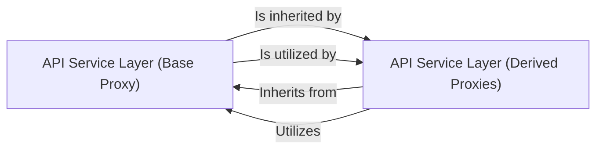

## Details

The `API Service Layer` in `XgagSPA` is structured around a `ProxyBase` class, which provides the fundamental mechanisms for making HTTP requests, including setting up request headers and handling authentication. This base class ensures a consistent approach to API communication across the application. Derived proxy classes extend this `ProxyBase`, specializing in interactions with specific API endpoints for different resources. This inheritance pattern allows for code reuse and maintains a clear separation of concerns, where the base handles common request logic and derived classes manage resource-specific operations. Critical interaction pathways involve derived proxy classes invoking the `getRequestInit` method (or similar common methods) from the `ProxyBase` to prepare their API requests. This interaction ensures that all API calls adhere to the defined standards for headers, authentication, and content types before specific resource operations are performed.

### API Service Layer (Base Proxy)
Provides a foundational class for all API proxy services, encapsulating common logic for making HTTP requests (e.g., setting headers, content types, authentication tokens via `getRequestInit`), error handling, and potentially response parsing. It ensures consistency across all API calls.

**Related Classes/Methods**:

- <a href="https://github.com/DrNerf/XgagSPA/blob/master/XgagSPA/ClientApp/Proxies/ProxyBase.tsx" target="_blank" rel="noopener noreferrer">`XgagSPA.ClientApp.Proxies.ProxyBase:getRequestInit`</a>

### API Service Layer (Derived Proxies)
Represents a set of specialized proxy classes, each responsible for interacting with a specific set of API endpoints related to a particular resource (e.g., user management, post management). They define methods for specific CRUD operations (Create, Read, Update, Delete) on their respective resources, leveraging the base functionality from `ProxyBase`.

**Related Classes/Methods**: _None_

### [FAQ](https://github.com/CodeBoarding/GeneratedOnBoardings/tree/main?tab=readme-ov-file#faq)