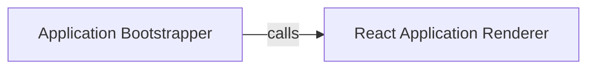

## Details

The XgagSPA project is a single-page application (SPA) built with React, utilizing client-side routing and hot module reloading for development. The core functionality revolves around rendering a dynamic user interface based on defined routes, with a clear separation between the application's bootstrapping process and its rendering logic.
The XgagSPA client-side application begins its execution with the `Application Bootstrapper` (`boot.tsx`). This component is responsible for the initial setup, including importing essential libraries and defining the application's routing configuration. Once the setup is complete, the `Application Bootstrapper` calls the `React Application Renderer` (`renderApp` function). The `React Application Renderer` then takes over, mounting the main React application component onto the DOM, making the application visible and interactive to the user. This clear separation of concerns ensures a structured and maintainable frontend architecture.

### Application Bootstrapper
This component, represented by the `boot.tsx` file, serves as the primary entry point for the client-side React application. It handles the initial setup, including importing necessary React and ReactDOM libraries, configuring client-side routing (e.g., React Router), and enabling hot module reloading for development. It acts as the central coordinator for starting the frontend application.

**Related Classes/Methods**:

- <a href="https://github.com/DrNerf/XgagSPA/blob/master/XgagSPA/ClientApp/boot.tsx#L1-L33" target="_blank" rel="noopener noreferrer">`/home/ivan/StartUp/CodeBoarding/repos/XgagSPA/XgagSPA/ClientApp/boot.tsx`:1-33</a>

### React Application Renderer
This component, embodied by the `renderApp` function, is specifically responsible for mounting the main React application component onto a designated HTML DOM element (e.g., `
`). It utilizes React's rendering APIs (e.g., `ReactDOM.render` or `ReactDOM.createRoot().render`) to make the application interactive and visible in the user's browser. It encapsulates the logic for updating the DOM with the React application.

**Related Classes/Methods**:

- <a href="https://github.com/DrNerf/XgagSPA/blob/master/XgagSPA/ClientApp/boot.tsx#L13-L23" target="_blank" rel="noopener noreferrer">`XgagSPA.ClientApp.boot.renderApp`:13-23</a>

### [FAQ](https://github.com/CodeBoarding/GeneratedOnBoardings/tree/main?tab=readme-ov-file#faq)