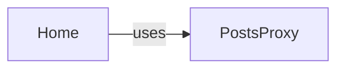

## Details

The main flow of the subsystem revolves around the Home component, which serves as the primary view for displaying posts. It interacts with the PostsProxy to fetch post data and statistics from the backend. When the user scrolls to the bottom of the page, the Home component triggers PostsProxy to load the next set of posts, demonstrating an infinite scrolling pattern. The subsystem's architecture is centered around a client-side React application that displays posts. The Home component is the central orchestrator, responsible for rendering the user interface and managing the display of posts. It leverages the PostsProxy component to interact with the backend API, abstracting the complexities of data retrieval. This separation of concerns allows the Home component to focus on UI presentation and user interaction, while PostsProxy handles network communication and data fetching. The system implements an infinite scrolling mechanism, where Home requests more data from PostsProxy as the user scrolls, providing a seamless browsing experience.

### Home
This is the primary React component responsible for rendering the user interface related to posts. It manages the display of posts, handles user interactions for loading more content (infinite scrolling), and orchestrates the data flow from the backend to the view. It acts as the "View" and "Controller" for the post display feature.

**Related Classes/Methods**:

- <a href="https://github.com/DrNerf/XgagSPA/blob/master/XgagSPA/ClientApp/components/Home.tsx#L19-L86" target="_blank" rel="noopener noreferrer">`Home`:19-86</a>

### PostsProxy
This component acts as a client-side abstraction layer for interacting with the backend API endpoints related to posts. It encapsulates the logic for making HTTP requests to fetch post data, adhering to the Proxy Pattern identified in the project context. It is responsible for abstracting the data retrieval process from the UI components.

**Related Classes/Methods**:

- <a href="https://github.com/DrNerf/XgagSPA/blob/master/XgagSPA/ClientApp/Proxies/PostsProxy.tsx#L5-L30" target="_blank" rel="noopener noreferrer">`PostsProxy`:5-30</a>

### [FAQ](https://github.com/CodeBoarding/GeneratedOnBoardings/tree/main?tab=readme-ov-file#faq)