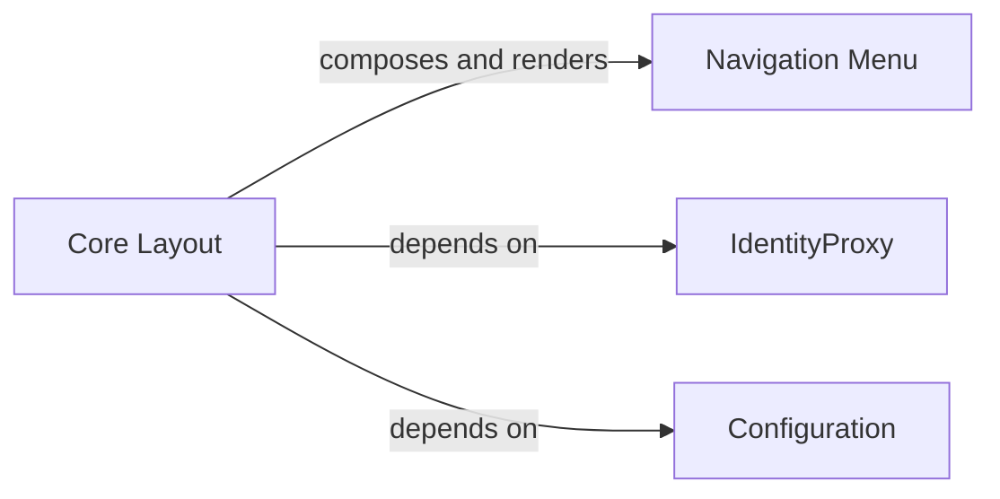

## Details

The XgagSPA client application is structured around a Core Layout that serves as the main container, defining the visual shell and managing global application state. This layout dynamically incorporates a Navigation Menu for user navigation. Crucially, the Core Layout integrates with external services, specifically IdentityProxy for authentication and Configuration for application settings, demonstrating a clear separation of concerns where the layout orchestrates UI presentation and state management while delegating specific functionalities to dedicated service components. This design promotes modularity and allows for independent development and maintenance of core UI elements and backend interactions.

### Core Layout
This component (XgagSPA.ClientApp.components.Layout.Layout) is the foundational element defining the overall page structure of the Single Page Application. It establishes the main visual shell, including areas for headers, footers, and the primary content. Beyond structural definition, it manages critical global application state, such as loading configurations and verifying user login status, and orchestrates the rendering of key navigation elements.

**Related Classes/Methods**:

- <a href="https://github.com/DrNerf/XgagSPA/blob/master/XgagSPA/ClientApp/components/Layout.tsx#L20-L69" target="_blank" rel="noopener noreferrer">`XgagSPA.ClientApp.components.Layout.Layout`:20-69</a>

### Navigation Menu
This component (XgagSPA.ClientApp.components.NavMenu.NavMenu) is responsible for rendering the application's primary navigation interface. It provides links to different sections of the SPA and can display dynamic, user-specific details (e.g., username, profile picture) within the navigation bar, typically received as properties from its parent component.

**Related Classes/Methods**:

- <a href="https://github.com/DrNerf/XgagSPA/blob/master/XgagSPA/ClientApp/components/NavMenu.tsx#L12-L54" target="_blank" rel="noopener noreferrer">`XgagSPA.ClientApp.components.NavMenu.NavMenu`:12-54</a>

### IdentityProxy
External service for verifying and managing user login session and status.

**Related Classes/Methods**: _None_

### Configuration
External service for loading and accessing application-wide configuration settings.

**Related Classes/Methods**: _None_

### [FAQ](https://github.com/CodeBoarding/GeneratedOnBoardings/tree/main?tab=readme-ov-file#faq)