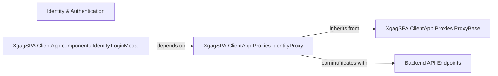

## Details

The XgagSPA authentication subsystem is structured around a clear separation of concerns. The client-side LoginModal provides the user interface, delegating authentication logic to the IdentityProxy. This proxy, built upon the reusable ProxyBase, handles the network communication with the Backend API Endpoints. The Backend API Endpoints are responsible for server-side validation and session management, forming a robust and modular authentication system.

### Identity & Authentication [[Expand]](./Identity_Authentication.md)
This is the overarching conceptual component representing the entire authentication and identity management functionality. It orchestrates user login, session verification, and manages user-related state across the application.

**Related Classes/Methods**: _None_

### XgagSPA.ClientApp.components.Identity.LoginModal
This React component provides the user interface for login. It captures user credentials and initiates the authentication flow by interacting with the IdentityProxy.

**Related Classes/Methods**:

- <a href="https://github.com/DrNerf/XgagSPA/blob/master/XgagSPA/ClientApp/components/Identity/LoginModal.tsx" target="_blank" rel="noopener noreferrer">`XgagSPA.ClientApp.components.Identity.LoginModal`</a>

### XgagSPA.ClientApp.Proxies.IdentityProxy
This component acts as the dedicated client-side service for all identity-related backend interactions. It encapsulates the logic for making API calls for user login and session verification, abstracting the network communication from UI components.

**Related Classes/Methods**:

- <a href="https://github.com/DrNerf/XgagSPA/blob/master/XgagSPA/ClientApp/Proxies/IdentityProxy.tsx" target="_blank" rel="noopener noreferrer">`XgagSPA.ClientApp.Proxies.IdentityProxy`</a>

### XgagSPA.ClientApp.Proxies.ProxyBase
This foundational component provides common request preparation logic and potentially error handling or token attachment mechanisms for all client-side proxy classes, promoting code reuse and consistency.

**Related Classes/Methods**:

- <a href="https://github.com/DrNerf/XgagSPA/blob/master/XgagSPA/ClientApp/Proxies/ProxyBase.tsx" target="_blank" rel="noopener noreferrer">`XgagSPA.ClientApp.Proxies.ProxyBase`</a>

### Backend API Endpoints
This represents the server-side part of the authentication system. It handles incoming login requests, validates credentials, generates authentication tokens (e.g., JWTs), and manages user sessions.

**Related Classes/Methods**: _None_

### [FAQ](https://github.com/CodeBoarding/GeneratedOnBoardings/tree/main?tab=readme-ov-file#faq)