```mermaid
graph LR
    Application_Entry_Point_Routing["Application Entry Point & Routing"]
    Configuration_Management["Configuration Management"]
    Core_Layout_Navigation["Core Layout & Navigation"]
    Identity_Authentication["Identity & Authentication"]
    Content_Management_Posts_Statistics_["Content Management (Posts & Statistics)"]
    Global_Application_State_Management["Global Application State Management"]
    API_Service_Layer["API Service Layer"]
    Reusable_UI_Components["Reusable UI Components"]
    Application_Entry_Point_Routing -- "initiates rendering of" --> Core_Layout_Navigation
    Core_Layout_Navigation -- "fetches settings from" --> Configuration_Management
    Core_Layout_Navigation -- "interacts with" --> Identity_Authentication
    Core_Layout_Navigation -- "receives user state from" --> Global_Application_State_Management
    Configuration_Management -- "provides settings to" --> Core_Layout_Navigation
    Configuration_Management -- "provides details to" --> Identity_Authentication
    Configuration_Management -- "provides details to" --> Content_Management_Posts_Statistics_
    Configuration_Management -- "provides details to" --> API_Service_Layer
    Identity_Authentication -- "updates state via" --> Global_Application_State_Management
    Identity_Authentication -- "leverages" --> API_Service_Layer
    Content_Management_Posts_Statistics_ -- "signals page load completion to" --> Global_Application_State_Management
    Content_Management_Posts_Statistics_ -- "utilizes" --> Reusable_UI_Components
    Content_Management_Posts_Statistics_ -- "leverages" --> API_Service_Layer
    Global_Application_State_Management -- "receives updates from" --> Identity_Authentication
    Global_Application_State_Management -- "receives signals from" --> Content_Management_Posts_Statistics_
    API_Service_Layer -- "is used by" --> Identity_Authentication
    API_Service_Layer -- "is used by" --> Content_Management_Posts_Statistics_
    Reusable_UI_Components -- "are utilized by" --> Content_Management_Posts_Statistics_
    click Application_Entry_Point_Routing href "https://github.com/CodeBoarding/GeneratedOnBoardings/blob/main/XgagSPA/Application_Entry_Point_Routing.md" "Details"
    click Core_Layout_Navigation href "https://github.com/CodeBoarding/GeneratedOnBoardings/blob/main/XgagSPA/Core_Layout_Navigation.md" "Details"
    click Identity_Authentication href "https://github.com/CodeBoarding/GeneratedOnBoardings/blob/main/XgagSPA/Identity_Authentication.md" "Details"
    click Content_Management_Posts_Statistics_ href "https://github.com/CodeBoarding/GeneratedOnBoardings/blob/main/XgagSPA/Content_Management_Posts_Statistics_.md" "Details"
    click API_Service_Layer href "https://github.com/CodeBoarding/GeneratedOnBoardings/blob/main/XgagSPA/API_Service_Layer.md" "Details"
```

## Details

The XgagSPA application is a React-based single-page application designed to display user posts and related statistics.

### Application Entry Point & Routing [[Expand]](./Application_Entry_Point_Routing.md)
Initializes the React application, sets up the root component, handles hot module reloading, and defines client-side routing.

**Related Classes/Methods**:

- <a href="https://github.com/DrNerf/XgagSPA/blob/master/XgagSPA/ClientApp/boot.tsx#L1-L33" target="_blank" rel="noopener noreferrer">`XgagSPA.ClientApp.boot.boot.tsx`:1-33</a>
- <a href="https://github.com/DrNerf/XgagSPA/blob/master/XgagSPA/ClientApp/boot.tsx#L13-L23" target="_blank" rel="noopener noreferrer">`XgagSPA.ClientApp.boot.renderApp`:13-23</a>

### Configuration Management
Manages and provides application-wide configuration settings, such as backend API endpoints.

**Related Classes/Methods**:

- <a href="https://github.com/DrNerf/XgagSPA/blob/master/XgagSPA/ClientApp/configuration.tsx#L9-L14" target="_blank" rel="noopener noreferrer">`XgagSPA.ClientApp.configuration.loadConfigurations`:9-14</a>

### Core Layout & Navigation [[Expand]](./Core_Layout_Navigation.md)
Defines the overall page structure, including headers, footers, and navigation. Manages global application state related to configuration loading and user login status.

**Related Classes/Methods**:

- <a href="https://github.com/DrNerf/XgagSPA/blob/master/XgagSPA/ClientApp/components/Layout.tsx#L20-L69" target="_blank" rel="noopener noreferrer">`XgagSPA.ClientApp.components.Layout.Layout`:20-69</a>
- <a href="https://github.com/DrNerf/XgagSPA/blob/master/XgagSPA/ClientApp/components/NavMenu.tsx#L17-L53" target="_blank" rel="noopener noreferrer">`XgagSPA.ClientApp.components.NavMenu.render`:17-53</a>

### Identity & Authentication [[Expand]](./Identity_Authentication.md)
Handles user login, session verification, and manages user-related state.

**Related Classes/Methods**:

- <a href="https://github.com/DrNerf/XgagSPA/blob/master/XgagSPA/ClientApp/components/Identity/LoginModal.tsx#L23-L45" target="_blank" rel="noopener noreferrer">`XgagSPA.ClientApp.components.Identity.LoginModal.login`:23-45</a>
- <a href="https://github.com/DrNerf/XgagSPA/blob/master/XgagSPA/ClientApp/Proxies/IdentityProxy.tsx#L6-L19" target="_blank" rel="noopener noreferrer">`XgagSPA.ClientApp.Proxies.IdentityProxy.login`:6-19</a>
- <a href="https://github.com/DrNerf/XgagSPA/blob/master/XgagSPA/ClientApp/Proxies/IdentityProxy.tsx#L21-L31" target="_blank" rel="noopener noreferrer">`XgagSPA.ClientApp.Proxies.IdentityProxy.verifySession`:21-31</a>

### Content Management (Posts & Statistics) [[Expand]](./Content_Management_Posts_Statistics_.md)
Fetches, processes, and displays user posts and related statistics, including infinite scrolling.

**Related Classes/Methods**:

- <a href="https://github.com/DrNerf/XgagSPA/blob/master/XgagSPA/ClientApp/components/Home.tsx#L57-L67" target="_blank" rel="noopener noreferrer">`XgagSPA.ClientApp.components.Home.componentDidMount`:57-67</a>
- <a href="https://github.com/DrNerf/XgagSPA/blob/master/XgagSPA/ClientApp/components/Home.tsx#L122-L130" target="_blank" rel="noopener noreferrer">`XgagSPA.ClientApp.components.Home.loadNextPage`:122-130</a>
- <a href="https://github.com/DrNerf/XgagSPA/blob/master/XgagSPA/ClientApp/components/Home.tsx#L104-L109" target="_blank" rel="noopener noreferrer">`XgagSPA.ClientApp.components.Home.renderPosts`:104-109</a>
- <a href="https://github.com/DrNerf/XgagSPA/blob/master/XgagSPA/ClientApp/Proxies/PostsProxy.tsx#L6-L17" target="_blank" rel="noopener noreferrer">`XgagSPA.ClientApp.Proxies.PostsProxy.getPosts`:6-17</a>

### Global Application State Management
Centralized management of dynamic application state, such as the current logged-in user and page load completion status.

**Related Classes/Methods**:

- <a href="https://github.com/DrNerf/XgagSPA/blob/master/XgagSPA/ClientApp/RuntimeInfo.tsx#L7-L9" target="_blank" rel="noopener noreferrer">`XgagSPA.ClientApp.RuntimeInfo.setCurrentUser`:7-9</a>
- <a href="https://github.com/DrNerf/XgagSPA/blob/master/XgagSPA/ClientApp/RuntimeInfo.tsx#L11-L15" target="_blank" rel="noopener noreferrer">`XgagSPA.ClientApp.RuntimeInfo.triggerPageLoadCompleted`:11-15</a>

### API Service Layer [[Expand]](./API_Service_Layer.md)
Provides a foundational class for all API proxy services, encapsulating common logic for making HTTP requests and defining DTOs.

**Related Classes/Methods**:

- <a href="https://github.com/DrNerf/XgagSPA/blob/master/XgagSPA/ClientApp/Proxies/ProxyBase.tsx#L4-L14" target="_blank" rel="noopener noreferrer">`XgagSPA.ClientApp.Proxies.ProxyBase.getRequestInit`:4-14</a>

### Reusable UI Components
A collection of generic, reusable UI components providing common functionalities like asynchronous image loading and loading spinners.

**Related Classes/Methods**:

- <a href="https://github.com/DrNerf/XgagSPA/blob/master/XgagSPA/ClientApp/components/System/AsyncImage.tsx#L39-L49" target="_blank" rel="noopener noreferrer">`XgagSPA.ClientApp.components.System.AsyncImage.render`:39-49</a>

### [FAQ](https://github.com/CodeBoarding/GeneratedOnBoardings/tree/main?tab=readme-ov-file#faq)