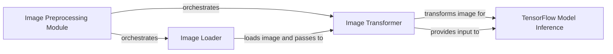

## Details

The image preprocessing pipeline within the YOLO_TF system is designed to prepare diverse image inputs for TensorFlow model inference. The Image Preprocessing Module, embodied by the YOLO_TF class, acts as the central orchestrator, initiating the process by either loading images from files or directly accepting in-memory image data. The Image Loader component, specifically the detect_from_file method, handles the initial acquisition of image data from file paths, converting it into a raw OpenCV cv::Mat format. Subsequently, the Image Transformer component, represented by the detect_from_cvmat method, applies a series of essential transformations, including resizing, color space conversion, and pixel normalization. This transformed image data is then prepared as a TensorFlow-compatible tensor, which is directly provided as input to the TensorFlow Model Inference component for object detection. This structured approach ensures efficient and accurate preparation of visual data for the downstream detection tasks.

### Image Preprocessing Module [[Expand]](./Image_Preprocessing_Module.md)
The central orchestrator, initiating the process by either loading images from files or directly accepting in-memory image data.

**Related Classes/Methods**:

- <a href="https://github.com/gliese581gg/YOLO_tensorflow/blob/master/YOLO_face_tf.py#L7-L230" target="_blank" rel="noopener noreferrer">`YOLO_TF`:7-230</a>

### Image Loader
Handles the initial acquisition of image data from file paths, converting it into a raw OpenCV cv::Mat format.

**Related Classes/Methods**:

### Image Transformer
Applies a series of essential transformations, including resizing, color space conversion, and pixel normalization.

**Related Classes/Methods**:

### TensorFlow Model Inference
Receives transformed image data for object detection.

**Related Classes/Methods**: _None_

### [FAQ](https://github.com/CodeBoarding/GeneratedOnBoardings/tree/main?tab=readme-ov-file#faq)