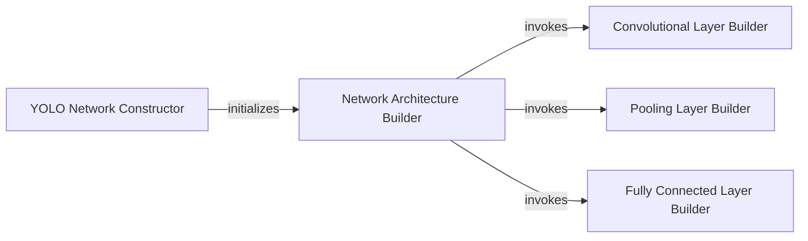

## Details

The Neural Network Graph Builder subsystem is dedicated to the programmatic construction of the YOLO neural network's computational graph using TensorFlow. It encapsulates the entire process of defining the model's architecture, from initialization to the creation of individual layers. This subsystem is responsible solely for the definition and construction of the TensorFlow graph, acting as the "Model Definition" or "Model Loader" component within the broader ML Toolkit architecture. It does not handle model training, inference execution, or post-processing.

### YOLO Network Constructor
Initializes the YOLO_face_tf class instance, setting up the necessary configuration and parameters for the network construction process. This component prepares the environment for building the TensorFlow graph.

**Related Classes/Methods**:

- <a href="https://github.com/gliese581gg/YOLO_tensorflow/blob/master/YOLO_face_tf.py#L27-L30" target="_blank" rel="noopener noreferrer">`YOLO_face_tf.__init__`:27-30</a>

### Network Architecture Builder
This is the core orchestrator responsible for assembling the complete YOLO computational graph. It defines the sequence and types of layers, invoking specialized builder components for each layer type.

**Related Classes/Methods**:

- <a href="https://github.com/gliese581gg/YOLO_tensorflow/blob/master/YOLO_face_tf.py#L43-L69" target="_blank" rel="noopener noreferrer">`YOLO_face_tf.build_networks`:43-69</a>

### Convolutional Layer Builder
Specializes in creating and configuring TensorFlow convolutional layers. It handles the specifics of filter sizes, strides, padding, and activation functions for these layers.

**Related Classes/Methods**:

- <a href="https://github.com/gliese581gg/YOLO_tensorflow/blob/master/YOLO_face_tf.py#L71-L83" target="_blank" rel="noopener noreferrer">`YOLO_face_tf.conv_layer`:71-83</a>

### Pooling Layer Builder
Responsible for constructing TensorFlow pooling layers (e.g., max pooling). It defines the pooling window size and stride, contributing to downsampling the feature maps.

**Related Classes/Methods**:

- <a href="https://github.com/gliese581gg/YOLO_tensorflow/blob/master/YOLO_face_tf.py#L85-L87" target="_blank" rel="noopener noreferrer">`YOLO_face_tf.pooling_layer`:85-87</a>

### Fully Connected Layer Builder
Creates and configures TensorFlow fully connected (dense) layers. These layers typically appear towards the end of the network, performing high-level feature combination and output prediction.

**Related Classes/Methods**:

- <a href="https://github.com/gliese581gg/YOLO_tensorflow/blob/master/YOLO_face_tf.py#L89-L103" target="_blank" rel="noopener noreferrer">`YOLO_face_tf.fc_layer`:89-103</a>

### [FAQ](https://github.com/CodeBoarding/GeneratedOnBoardings/tree/main?tab=readme-ov-file#faq)