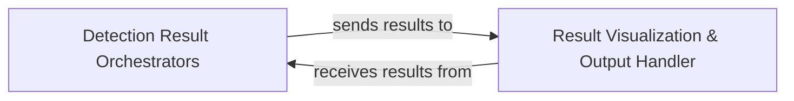

## Details

The `YOLO_tensorflow` subsystem, primarily driven by `YOLO_face_tf.py`, is structured around two core architectural components: the **Detection Result Orchestrators** and the **Result Visualization & Output Handler**. The **Detection Result Orchestrators** component, encompassing functions like `detect_from_cvmat` and `detect_from_crop_sample`, is responsible for executing the face detection inference and preparing the raw detection outputs. These processed results are then seamlessly transferred to the **Result Visualization & Output Handler** component, which includes the `show_results` function. This handler is tasked with rendering the detected faces, complete with bounding boxes and labels, onto the input image, thereby making the detection outcomes visually interpretable. This clear separation of concerns ensures a streamlined flow from detection execution to result presentation, forming a robust and easily understandable pipeline for face detection.

### Detection Result Orchestrators
This component is responsible for orchestrating and providing detection results to subsequent components, such as the Result Visualization & Output Handler. It includes methods for detecting objects from various inputs like CVMat or cropped samples, acting as the bridge between the inference engine and the post-processing/output stages.

**Related Classes/Methods**:

- <a href="https://github.com/gliese581gg/YOLO_tensorflow/blob/master/YOLO_face_tf.py#L1-L2" target="_blank" rel="noopener noreferrer">`YOLO_face_tf.py:detect_from_cvmat`:1-2</a>
- <a href="https://github.com/gliese581gg/YOLO_tensorflow/blob/master/YOLO_face_tf.py#L1-L2" target="_blank" rel="noopener noreferrer">`YOLO_face_tf.py:detect_from_crop_sample`:1-2</a>

### Result Visualization & Output Handler [[Expand]](./Result_Visualization_Output_Handler.md)
This component manages the presentation and output of the final detected objects and their bounding boxes. It takes processed detection data (e.g., image, bounding box coordinates, labels) and renders them onto the image. Its functionalities include drawing bounding boxes and labels, and potentially displaying the image or saving it to a file. It serves as the terminal stage of the object detection pipeline, ensuring that the results are consumable by the user or subsequent systems.

**Related Classes/Methods**:

- <a href="https://github.com/gliese581gg/YOLO_tensorflow/blob/master/YOLO_face_tf.py#L1-L2" target="_blank" rel="noopener noreferrer">`YOLO_face_tf.py:show_results`:1-2</a>

### [FAQ](https://github.com/CodeBoarding/GeneratedOnBoardings/tree/main?tab=readme-ov-file#faq)