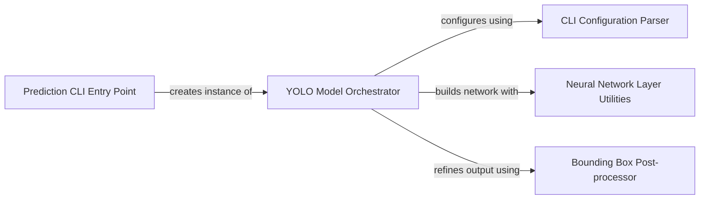

## Details

The YOLO Model Orchestrator subsystem is a specialized part of the project focused on executing YOLO (You Only Look Once) object detection models using TensorFlow. It encapsulates the entire lifecycle of a YOLO model, from loading and setup to performing inference and interpreting results.

### YOLO Model Orchestrator [[Expand]](./YOLO_Model_Orchestrator.md)
This is the core component responsible for managing the entire YOLO model lifecycle. It handles loading pre-trained model weights, setting up the TensorFlow session, building the neural network, executing inference on input data (from files, OpenCV matrices, or cropped samples), and interpreting the raw model output into meaningful detections. It also includes functionality for visualizing results.

**Related Classes/Methods**:

- <a href="https://github.com/gliese581gg/YOLO_tensorflow/blob/master/YOLO_face_tf.py#L7-L230" target="_blank" rel="noopener noreferrer">`YOLO_TF`:7-230</a>
- <a href="https://github.com/gliese581gg/YOLO_tensorflow/blob/master/YOLO_face_tf.py#L7-L230" target="_blank" rel="noopener noreferrer">`YOLO_TF`:7-230</a>
- <a href="https://github.com/gliese581gg/YOLO_tensorflow/blob/master/YOLO_face_tf.py#L7-L230" target="_blank" rel="noopener noreferrer">`YOLO_TF`:7-230</a>

### CLI Configuration Parser
This component is responsible for parsing and interpreting command-line arguments provided by the user. It extracts configuration parameters necessary for the YOLO Model Orchestrator to initialize and run, such as model paths, input sources, and output preferences.

**Related Classes/Methods**:

- <a href="https://github.com/gliese581gg/YOLO_tensorflow/blob/master/YOLO_face_tf.py#L31-L41" target="_blank" rel="noopener noreferrer">`argv_parser`:31-41</a>

### Neural Network Layer Utilities
This component comprises a collection of fundamental building blocks for constructing neural network architectures. It includes low-level functions like convolutional layers (conv_layer), pooling layers (pooling_layer), and fully connected layers (fc_layer), which are utilized by the YOLO Model Orchestrator to define and build the specific YOLO model graph in TensorFlow.

**Related Classes/Methods**:

- <a href="https://github.com/gliese581gg/YOLO_tensorflow/blob/master/YOLO_face_tf.py#L71-L83" target="_blank" rel="noopener noreferrer">`conv_layer`:71-83</a>
- <a href="https://github.com/gliese581gg/YOLO_tensorflow/blob/master/YOLO_face_tf.py#L85-L87" target="_blank" rel="noopener noreferrer">`pooling_layer`:85-87</a>
- <a href="https://github.com/gliese581gg/YOLO_tensorflow/blob/master/YOLO_face_tf.py#L89-L103" target="_blank" rel="noopener noreferrer">`fc_layer`:89-103</a>

### Bounding Box Post-processor
This utility component provides the Intersection Over Union (IoU) calculation, a critical metric used in object detection post-processing. Its primary responsibility is to help filter and refine the raw bounding box predictions from the model, typically by suppressing redundant or overlapping detections (Non-Maximum Suppression).

**Related Classes/Methods**:

- <a href="https://github.com/gliese581gg/YOLO_tensorflow/blob/master/YOLO_face_tf.py" target="_blank" rel="noopener noreferrer">`iou`</a>

### Prediction CLI Entry Point
This component serves as the primary command-line interface for the entire YOLO prediction subsystem. It acts as the orchestrator for user interactions, initializing the YOLO Model Orchestrator, passing parsed arguments, and initiating the detection process based on user commands.

**Related Classes/Methods**:

- <a href="https://github.com/gliese581gg/YOLO_tensorflow/blob/master/YOLO_face_tf.py#L235-L237" target="_blank" rel="noopener noreferrer">`main`:235-237</a>

### [FAQ](https://github.com/CodeBoarding/GeneratedOnBoardings/tree/main?tab=readme-ov-file#faq)