```mermaid
graph LR
    Application_Entry_Point_CLI_API_["Application Entry Point (CLI/API)"]
    YOLO_Model_Orchestrator["YOLO Model Orchestrator"]
    Neural_Network_Graph_Builder["Neural Network Graph Builder"]
    Image_Preprocessing_Module["Image Preprocessing Module"]
    TensorFlow_Inference_Engine["TensorFlow Inference Engine"]
    Detection_Post_processing_Module["Detection Post-processing Module"]
    Result_Visualization_Output_Handler["Result Visualization & Output Handler"]
    Application_Entry_Point_CLI_API_ -- "initiates" --> YOLO_Model_Orchestrator
    YOLO_Model_Orchestrator -- "builds graph via" --> Neural_Network_Graph_Builder
    YOLO_Model_Orchestrator -- "requests data from" --> Image_Preprocessing_Module
    Image_Preprocessing_Module -- "feeds preprocessed data to" --> TensorFlow_Inference_Engine
    TensorFlow_Inference_Engine -- "outputs raw predictions to" --> Detection_Post_processing_Module
    Detection_Post_processing_Module -- "sends refined detections to" --> Result_Visualization_Output_Handler
    Result_Visualization_Output_Handler -- "presents results to" --> Application_Entry_Point_CLI_API_
    click YOLO_Model_Orchestrator href "https://github.com/CodeBoarding/GeneratedOnBoardings/blob/main/YOLO_tensorflow/YOLO_Model_Orchestrator.md" "Details"
    click Neural_Network_Graph_Builder href "https://github.com/CodeBoarding/GeneratedOnBoardings/blob/main/YOLO_tensorflow/Neural_Network_Graph_Builder.md" "Details"
    click Image_Preprocessing_Module href "https://github.com/CodeBoarding/GeneratedOnBoardings/blob/main/YOLO_tensorflow/Image_Preprocessing_Module.md" "Details"
    click Detection_Post_processing_Module href "https://github.com/CodeBoarding/GeneratedOnBoardings/blob/main/YOLO_tensorflow/Detection_Post_processing_Module.md" "Details"
    click Result_Visualization_Output_Handler href "https://github.com/CodeBoarding/GeneratedOnBoardings/blob/main/YOLO_tensorflow/Result_Visualization_Output_Handler.md" "Details"
```

## Details

The `YOLO_tensorflow` project is structured as a robust object detection pipeline, designed for both command-line utility and library integration. Its architecture centers around a clear data flow: the `Application Entry Point` initializes a specific `YOLO Model Orchestrator`, which in turn leverages the `Neural Network Graph Builder` to define the model's structure. Input images are prepared by the `Image Preprocessing Module` before being processed by the `TensorFlow Inference Engine`. Raw predictions then flow to the `Detection Post-processing Module` for refinement, and finally, the `Result Visualization & Output Handler` presents the detected objects. This modular design ensures a streamlined and efficient prediction workflow, ideal for visual representation as a sequential data pipeline.

### Application Entry Point (CLI/API)
Manages user interaction, argument parsing, and orchestrates the overall detection process. It serves as the primary interface for users to initiate object detection.

**Related Classes/Methods**:

- <a href="https://github.com/gliese581gg/YOLO_tensorflow/blob/master/YOLO_face_tf.py" target="_blank" rel="noopener noreferrer">`YOLO_face_tf.py`</a>
- <a href="https://github.com/gliese581gg/YOLO_tensorflow/blob/master/YOLO_tiny_tf.py" target="_blank" rel="noopener noreferrer">`YOLO_tiny_tf.py`</a>
- <a href="https://github.com/gliese581gg/YOLO_tensorflow/blob/master/YOLO_small_tf.py" target="_blank" rel="noopener noreferrer">`YOLO_small_tf.py`</a>

### YOLO Model Orchestrator [[Expand]](./YOLO_Model_Orchestrator.md)
Encapsulates the specific YOLO model variant. It is responsible for loading pre-trained model weights, setting up the TensorFlow session, and coordinating the prediction lifecycle for its respective model.

**Related Classes/Methods**:

- <a href="https://github.com/gliese581gg/YOLO_tensorflow/blob/master/YOLO_face_tf.py" target="_blank" rel="noopener noreferrer">`YOLO_face_tf.py`</a>
- <a href="https://github.com/gliese581gg/YOLO_tensorflow/blob/master/YOLO_tiny_tf.py" target="_blank" rel="noopener noreferrer">`YOLO_tiny_tf.py`</a>
- <a href="https://github.com/gliese581gg/YOLO_tensorflow/blob/master/YOLO_small_tf.py" target="_blank" rel="noopener noreferrer">`YOLO_small_tf.py`</a>

### Neural Network Graph Builder [[Expand]](./Neural_Network_Graph_Builder.md)
Dynamically constructs the TensorFlow computational graph that defines the YOLO neural network architecture, including its layers and connections.

**Related Classes/Methods**:

- <a href="https://github.com/gliese581gg/YOLO_tensorflow/blob/master/YOLO_face_tf.py" target="_blank" rel="noopener noreferrer">`YOLO_face_tf.py`</a>

### Image Preprocessing Module [[Expand]](./Image_Preprocessing_Module.md)
Handles the loading of image data from various sources and prepares it (e.g., resizing, normalization) into the correct format required for TensorFlow model inference.

**Related Classes/Methods**:

- <a href="https://github.com/gliese581gg/YOLO_tensorflow/blob/master/YOLO_face_tf.py" target="_blank" rel="noopener noreferrer">`YOLO_face_tf.py`</a>

### TensorFlow Inference Engine
Executes the preprocessed image data through the loaded TensorFlow graph, performing the actual forward pass of the neural network to obtain raw prediction outputs.

**Related Classes/Methods**:

- <a href="https://github.com/gliese581gg/YOLO_tensorflow/blob/master/YOLO_face_tf.py" target="_blank" rel="noopener noreferrer">`YOLO_face_tf.py`</a>

### Detection Post-processing Module [[Expand]](./Detection_Post_processing_Module.md)
Interprets the raw numerical output from the neural network into meaningful object detection results, applying confidence thresholds, IOU, and Non-Maximum Suppression (NMS).

**Related Classes/Methods**:

- <a href="https://github.com/gliese581gg/YOLO_tensorflow/blob/master/YOLO_face_tf.py" target="_blank" rel="noopener noreferrer">`YOLO_face_tf.py`</a>

### Result Visualization & Output Handler [[Expand]](./Result_Visualization_Output_Handler.md)
Manages the presentation and output of the final detected objects and their bounding boxes, which can include drawing on images, saving files, or console output.

**Related Classes/Methods**:

- <a href="https://github.com/gliese581gg/YOLO_tensorflow/blob/master/YOLO_face_tf.py" target="_blank" rel="noopener noreferrer">`YOLO_face_tf.py`</a>

### [FAQ](https://github.com/CodeBoarding/GeneratedOnBoardings/tree/main?tab=readme-ov-file#faq)