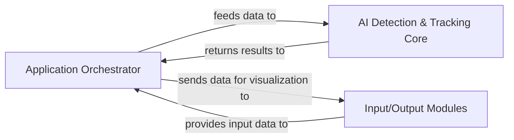

## Details

The system is structured around an Application Orchestrator that serves as the central control unit, managing the video processing pipeline. It interacts with an AI Detection & Tracking Core responsible for object detection and tracking using YOLOv5 and DeepSort. Input and output operations, including video capture, display, and saving, are handled by the Input/Output Modules, which are tightly integrated within the Application Orchestrator's execution flow. This architecture ensures a clear separation of concerns between orchestration, AI processing, and I/O management, facilitating modularity and maintainability.

### Application Orchestrator [[Expand]](./Application_Orchestrator.md)
The central control unit and primary entry point of the application. It initializes the system, manages the video stream, and orchestrates the sequence of operations from detection to tracking, post-processing, and visualization. It ensures the seamless flow of data between specialized components.

**Related Classes/Methods**:

- <a href="https://github.com/Sharpiless/Yolov5-deepsort-inference/blob/master/demo.py" target="_blank" rel="noopener noreferrer">`demo.py:main`</a>

### AI Detection & Tracking Core
Responsible for performing AI-powered object detection (using YOLOv5) and object tracking (using DeepSort). It processes raw input data received from the orchestrator and returns structured detection and tracking results. This component embodies the "Encapsulation of ML Models" architectural bias.

**Related Classes/Methods**:

- <a href="https://github.com/Sharpiless/Yolov5-deepsort-inference/blob/master/AIDetector_pytorch.py" target="_blank" rel="noopener noreferrer">`AIDetector_pytorch.py:Detector`</a>

### Input/Output Modules
Handles the management of input data streams (e.g., video file readers, camera interfaces) and output visualization components (e.g., displaying annotated frames, generating reports). It facilitates the overall data flow from the source to the display.

**Related Classes/Methods**:

- <a href="https://github.com/Sharpiless/Yolov5-deepsort-inference/blob/master/demo.py" target="_blank" rel="noopener noreferrer">`cv2.VideoCapture`</a>
- <a href="https://github.com/Sharpiless/Yolov5-deepsort-inference/blob/master/demo.py" target="_blank" rel="noopener noreferrer">`cv2.imshow`</a>
- <a href="https://github.com/Sharpiless/Yolov5-deepsort-inference/blob/master/demo.py" target="_blank" rel="noopener noreferrer">`cv2.VideoWriter`</a>

### [FAQ](https://github.com/CodeBoarding/GeneratedOnBoardings/tree/main?tab=readme-ov-file#faq)