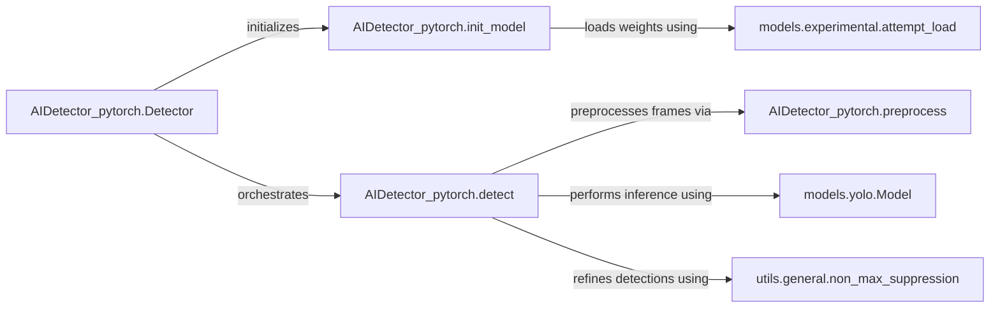

## Details

The `AIDetector_pytorch` system provides a robust framework for real-time object detection using the YOLOv5 model. The `Detector` component acts as the central orchestrator, managing the entire detection pipeline from model initialization to final output. It leverages specialized components for preprocessing input frames, performing neural network inference, and refining detections through Non-Maximum Suppression. This modular design ensures efficient and accurate object detection, making it suitable for various computer vision applications.

### AIDetector_pytorch.Detector
Serves as the high-level API for object detection, managing the lifecycle of the YOLOv5 model, including its initialization and the execution of the full detection pipeline.

**Related Classes/Methods**:

- <a href="https://github.com/Sharpiless/Yolov5-deepsort-inference/blob/master/AIDetector_pytorch.py#L16-L27" target="_blank" rel="noopener noreferrer">`AIDetector_pytorch.init_model`:16-27</a>
- <a href="https://github.com/Sharpiless/Yolov5-deepsort-inference/blob/master/AIDetector_pytorch.py#L43-L67" target="_blank" rel="noopener noreferrer">`AIDetector_pytorch.detect`:43-67</a>

### AIDetector_pytorch.init_model
Handles the loading and configuration of the YOLOv5 model weights and architecture.

**Related Classes/Methods**:

- <a href="https://github.com/Sharpiless/Yolov5-deepsort-inference/blob/master/models/experimental.py#L132-L155" target="_blank" rel="noopener noreferrer">`models.experimental.attempt_load`:132-155</a>

### AIDetector_pytorch.detect
Executes the complete object detection pipeline for a given input frame, encompassing preprocessing, inference, and post-processing (Non-Maximum Suppression).

**Related Classes/Methods**:

- <a href="https://github.com/Sharpiless/Yolov5-deepsort-inference/blob/master/AIDetector_pytorch.py#L29-L41" target="_blank" rel="noopener noreferrer">`AIDetector_pytorch.preprocess`:29-41</a>
- <a href="https://github.com/Sharpiless/Yolov5-deepsort-inference/blob/master/models/yolo.py" target="_blank" rel="noopener noreferrer">`models.yolo.Model`</a>
- <a href="https://github.com/Sharpiless/Yolov5-deepsort-inference/blob/master/utils/general.py#L271-L361" target="_blank" rel="noopener noreferrer">`utils.general.non_max_suppression`:271-361</a>

### AIDetector_pytorch.preprocess
Transforms raw input frames into the specific format required by the YOLOv5 model (e.g., resizing, normalization, transposing, and converting to PyTorch tensor).

**Related Classes/Methods**:

- <a href="https://github.com/Sharpiless/Yolov5-deepsort-inference/blob/master/AIDetector_pytorch.py#L29-L41" target="_blank" rel="noopener noreferrer">`AIDetector_pytorch.preprocess`:29-41</a>

### models.yolo.Model
Implements the core YOLOv5 neural network architecture, including the forward pass logic to generate raw object detections. This component is responsible for defining, building, and executing the YOLO model.

**Related Classes/Methods**:

- <a href="https://github.com/Sharpiless/Yolov5-deepsort-inference/blob/master/models/yolo.py" target="_blank" rel="noopener noreferrer">`models.yolo.Model`</a>

### models.experimental.attempt_load
Manages the loading of pre-trained model weights, accommodating various model configurations and formats. It handles the deserialization of the model and prepares it for inference.

**Related Classes/Methods**:

- <a href="https://github.com/Sharpiless/Yolov5-deepsort-inference/blob/master/models/experimental.py#L132-L155" target="_blank" rel="noopener noreferrer">`models.experimental.attempt_load`:132-155</a>

### utils.general.non_max_suppression
Filters out redundant and overlapping bounding box detections, retaining only the most confident and distinct ones. This is a critical post-processing step to improve detection accuracy.

**Related Classes/Methods**:

- <a href="https://github.com/Sharpiless/Yolov5-deepsort-inference/blob/master/utils/general.py#L271-L361" target="_blank" rel="noopener noreferrer">`utils.general.non_max_suppression`:271-361</a>

### [FAQ](https://github.com/CodeBoarding/GeneratedOnBoardings/tree/main?tab=readme-ov-file#faq)