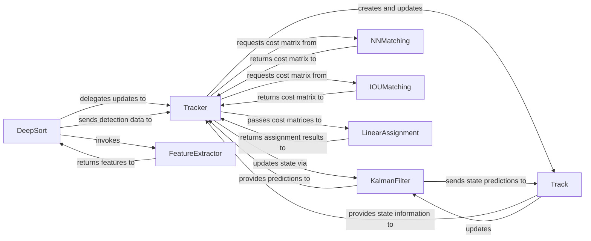

## Details

The DeepSort subsystem orchestrates multi-object tracking by integrating appearance features with motion-based predictions. The `DeepSort` component serves as the entry point, receiving detections and delegating the core tracking logic to the `Tracker`. The `FeatureExtractor` is invoked by `DeepSort` to generate appearance embeddings for new detections. The `Tracker` is central, managing individual `Track` lifecycles and performing data association. It leverages the `KalmanFilter` for state estimation and prediction, and utilizes both `NNMatching` (for appearance-based costs) and `IOUMatching` (for geometric costs) to generate similarity matrices. These cost matrices are then passed to `LinearAssignment` to determine optimal track-detection assignments. Each `Track` object encapsulates the state of a single tracked entity, maintaining its history and interacting with the `KalmanFilter` for state updates.

### DeepSort
Orchestrates the DeepSort algorithm's overall flow. It receives object detections, prepares them for tracking, and delegates the update process to the `Tracker`. It manages the high-level data flow within the module.

**Related Classes/Methods**:

- <a href="https://github.com/Sharpiless/Yolov5-deepsort-inference/blob/master/deep_sort/deep_sort/deep_sort.py#L14-L113" target="_blank" rel="noopener noreferrer">`deep_sort.deep_sort.deep_sort.DeepSort`:14-113</a>

### Tracker
Manages the lifecycle of individual tracks (initiation, update, termination) and performs data association, matching existing tracks with new detections. It is the central coordinator for track management.

**Related Classes/Methods**:

- <a href="https://github.com/Sharpiless/Yolov5-deepsort-inference/blob/master/deep_sort/deep_sort/sort/tracker.py#L10-L138" target="_blank" rel="noopener noreferrer">`deep_sort.deep_sort.sort.tracker.Tracker`:10-138</a>

### FeatureExtractor
Extracts deep appearance features (embeddings) from image patches corresponding to detected objects. These features are vital for re-identifying objects across frames, providing the "deep" aspect of DeepSort.

**Related Classes/Methods**:

- <a href="https://github.com/Sharpiless/Yolov5-deepsort-inference/blob/master/deep_sort/deep_sort/deep/feature_extractor.py" target="_blank" rel="noopener noreferrer">`deep_sort.deep_sort.deep.feature_extractor.FeatureExtractor`</a>

### KalmanFilter
Implements a Kalman filter for each `Track` object to estimate and predict its state (position, velocity) over time. It handles measurement noise and provides a smooth trajectory, crucial for robust tracking.

**Related Classes/Methods**:

- <a href="https://github.com/Sharpiless/Yolov5-deepsort-inference/blob/master/deep_sort/deep_sort/sort/kalman_filter.py#L23-L229" target="_blank" rel="noopener noreferrer">`deep_sort.deep_sort.sort.kalman_filter.KalmanFilter`:23-229</a>

### NNMatching
Computes appearance-based distance metrics (e.g., cosine distance) between the feature vectors of existing tracks and new detections. This component quantifies how visually similar tracks and detections are.

**Related Classes/Methods**:

- <a href="https://github.com/Sharpiless/Yolov5-deepsort-inference/blob/master/deep_sort/deep_sort/sort/nn_matching.py" target="_blank" rel="noopener noreferrer">`deep_sort.deep_sort.sort.nn_matching`</a>

### IOUMatching
Computes Intersection Over Union (IOU) cost between the bounding boxes of existing tracks and new detections. This provides a geometric measure of overlap, complementing the appearance-based matching.

**Related Classes/Methods**:

- <a href="https://github.com/Sharpiless/Yolov5-deepsort-inference/blob/master/deep_sort/deep_sort/sort/iou_matching.py" target="_blank" rel="noopener noreferrer">`deep_sort.deep_sort.sort.iou_matching`</a>

### LinearAssignment
Solves the linear assignment problem (e.g., using the Hungarian algorithm) to find the optimal one-to-one mapping between tracks and detections based on a given cost matrix. It resolves ambiguities in associations.

**Related Classes/Methods**:

- <a href="https://github.com/Sharpiless/Yolov5-deepsort-inference/blob/master/deep_sort/deep_sort/sort/linear_assignment.py" target="_blank" rel="noopener noreferrer">`deep_sort.deep_sort.sort.linear_assignment`</a>

### Track
Encapsulates the complete state of a single tracked object. This includes its unique ID, bounding box history, appearance features, and its associated `KalmanFilter` instance. It represents the fundamental unit of tracking.

**Related Classes/Methods**:

- <a href="https://github.com/Sharpiless/Yolov5-deepsort-inference/blob/master/deep_sort/deep_sort/sort/track.py#L19-L166" target="_blank" rel="noopener noreferrer">`deep_sort.deep_sort.sort.track.Track`:19-166</a>

### [FAQ](https://github.com/CodeBoarding/GeneratedOnBoardings/tree/main?tab=readme-ov-file#faq)