```mermaid
graph LR
    Application_Orchestrator["Application Orchestrator"]
    Input_Preprocessing_Module["Input/Preprocessing Module"]
    Object_Detection_Module_YOLOv5_["Object Detection Module (YOLOv5)"]
    Detection_Post_processing_Unit["Detection Post-processing Unit"]
    Re_ID_Feature_Extraction_Unit["Re-ID Feature Extraction Unit"]
    Object_Tracking_Module_DeepSort_["Object Tracking Module (DeepSort)"]
    Output_Visualization_Module["Output Visualization Module"]
    Application_Orchestrator -- "feeds raw video frames to" --> Input_Preprocessing_Module
    Input_Preprocessing_Module -- "outputs preprocessed frames to" --> Object_Detection_Module_YOLOv5_
    Object_Detection_Module_YOLOv5_ -- "provides raw object detections to" --> Detection_Post_processing_Unit
    Detection_Post_processing_Unit -- "sends refined detections for feature extraction to" --> Re_ID_Feature_Extraction_Unit
    Detection_Post_processing_Unit -- "sends refined detections for tracking to" --> Object_Tracking_Module_DeepSort_
    Re_ID_Feature_Extraction_Unit -- "provides appearance features for re-identification to" --> Object_Tracking_Module_DeepSort_
    Object_Tracking_Module_DeepSort_ -- "outputs tracked object information to" --> Output_Visualization_Module
    Output_Visualization_Module -- "returns annotated frames to" --> Application_Orchestrator
    click Application_Orchestrator href "https://github.com/CodeBoarding/GeneratedOnBoardings/blob/main/Yolov5-deepsort-inference/Application_Orchestrator.md" "Details"
    click Object_Detection_Module_YOLOv5_ href "https://github.com/CodeBoarding/GeneratedOnBoardings/blob/main/Yolov5-deepsort-inference/Object_Detection_Module_YOLOv5_.md" "Details"
    click Re_ID_Feature_Extraction_Unit href "https://github.com/CodeBoarding/GeneratedOnBoardings/blob/main/Yolov5-deepsort-inference/Re_ID_Feature_Extraction_Unit.md" "Details"
    click Object_Tracking_Module_DeepSort_ href "https://github.com/CodeBoarding/GeneratedOnBoardings/blob/main/Yolov5-deepsort-inference/Object_Tracking_Module_DeepSort_.md" "Details"
```

## Details

The Yolov5-deepsort-inference project is structured as a modular AI/ML pipeline for real-time object detection and tracking. It follows a clear data flow pattern, starting with an Application Orchestrator that manages the input video stream. Frames are sequentially processed through an Input/Preprocessing Module, an Object Detection Module (YOLOv5) for initial inference, and a Detection Post-processing Unit for refinement. The refined detections then feed into a Re-ID Feature Extraction Unit and an Object Tracking Module (DeepSort), which together handle multi-object tracking. Finally, an Output Visualization Module renders the tracking results onto the frames, completing the processing chain. This architecture emphasizes clear component boundaries, facilitating understanding of data transformation and control flow for diagrammatic representation.

### Application Orchestrator [[Expand]](./Application_Orchestrator.md)
The central control unit that initializes the system, manages the video stream, and orchestrates the sequence of operations from detection to tracking and visualization. It acts as the main entry point of the application.

**Related Classes/Methods**:

- <a href="https://github.com/Sharpiless/Yolov5-deepsort-inference/blob/master/demo.py" target="_blank" rel="noopener noreferrer">`demo.py:main`</a>

### Input/Preprocessing Module
Handles the initial processing of raw input frames, including resizing, normalization, and conversion to the appropriate tensor format required by the object detection model.

**Related Classes/Methods**:

- <a href="https://github.com/Sharpiless/Yolov5-deepsort-inference/blob/master/AIDetector_pytorch.py" target="_blank" rel="noopener noreferrer">`AIDetector_pytorch.Detector.preprocess`</a>

### Object Detection Module (YOLOv5) [[Expand]](./Object_Detection_Module_YOLOv5_.md)
Encapsulates the YOLOv5 model, performing inference on preprocessed frames to identify objects and generate raw bounding box detections with confidence scores. This module also handles the loading and initialization of the YOLO model weights.

**Related Classes/Methods**:

- <a href="https://github.com/Sharpiless/Yolov5-deepsort-inference/blob/master/AIDetector_pytorch.py" target="_blank" rel="noopener noreferrer">`AIDetector_pytorch.Detector.init_model`</a>
- <a href="https://github.com/Sharpiless/Yolov5-deepsort-inference/blob/master/AIDetector_pytorch.py" target="_blank" rel="noopener noreferrer">`AIDetector_pytorch.Detector.detect`</a>

### Detection Post-processing Unit
Refines the raw detections from the Object Detection Module by applying Non-Maximum Suppression (NMS) to eliminate redundant or overlapping bounding boxes, ensuring only the most confident and distinct detections are passed on.

**Related Classes/Methods**:

- <a href="https://github.com/Sharpiless/Yolov5-deepsort-inference/blob/master/utils/general.py#L271-L361" target="_blank" rel="noopener noreferrer">`utils.general.non_max_suppression`:271-361</a>

### Re-ID Feature Extraction Unit [[Expand]](./Re_ID_Feature_Extraction_Unit.md)
Extracts deep appearance features (re-identification features) from detected object bounding boxes. These features are crucial for the DeepSort algorithm to re-identify objects across different frames, even if they are temporarily occluded or change appearance slightly.

**Related Classes/Methods**:

- <a href="https://github.com/Sharpiless/Yolov5-deepsort-inference/blob/master/deep_sort/deep_sort/deep/feature_extractor.py" target="_blank" rel="noopener noreferrer">`deep_sort.deep_sort.deep.feature_extractor.FeatureExtractor.__call__`</a>

### Object Tracking Module (DeepSort) [[Expand]](./Object_Tracking_Module_DeepSort_.md)
Implements the DeepSort algorithm, which takes refined object detections and their re-identification features to track objects across consecutive video frames. It assigns and maintains unique IDs for each tracked object, predicting their positions and handling associations.

**Related Classes/Methods**:

- <a href="https://github.com/Sharpiless/Yolov5-deepsort-inference/blob/master/deep_sort/deep_sort/deep_sort.py" target="_blank" rel="noopener noreferrer">`deep_sort.deep_sort.deep_sort.DeepSort.update`</a>

### Output Visualization Module
Responsible for rendering the final tracked objects (bounding boxes, IDs, confidence scores) onto the original video frames. This module prepares the frames for display or saving, making the tracking results visually interpretable.

**Related Classes/Methods**:

- <a href="https://github.com/Sharpiless/Yolov5-deepsort-inference/blob/master/deep_sort/utils/draw.py#L15-L30" target="_blank" rel="noopener noreferrer">`deep_sort.utils.draw.draw_boxes`:15-30</a>

### [FAQ](https://github.com/CodeBoarding/GeneratedOnBoardings/tree/main?tab=readme-ov-file#faq)