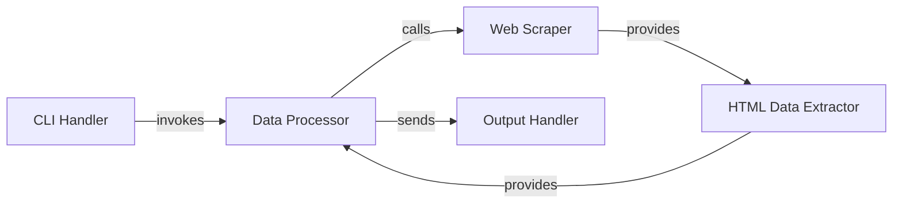

## Details

One paragraph explaining the functionality which is represented by this graph. What the main flow is and what is its purpose.

### CLI Handler
This component is responsible for parsing command-line arguments (search term, start date, end date, and optional output file), validating the input, and orchestrating the overall execution flow of the script. It serves as the primary entry point for the utility.

**Related Classes/Methods**:

- <a href="https://github.com/recursionpharma/academic-keyword-occurrence/blob/trunk/extract_occurrences.py#L72-L92" target="_blank" rel="noopener noreferrer">`extract_occurrences.py` (72:92)</a>

### Web Scraper
This component handles the fetching of web page content from Google Scholar. It constructs the appropriate URL with search parameters, sets user-agent headers, manages cookies for session persistence, and executes the HTTP request to retrieve the raw HTML response.

**Related Classes/Methods**:

- <a href="https://github.com/recursionpharma/academic-keyword-occurrence/blob/trunk/extract_occurrences.py#L16-L46" target="_blank" rel="noopener noreferrer">`extract_occurrences.py:get_num_results` (16:46)</a>

### HTML Data Extractor [[Expand]](./HTML_Data_Extractor.md)
This component is dedicated to parsing the raw HTML content received from the `Web Scraper`. It utilizes BeautifulSoup to navigate the HTML structure, specifically locating the `div` element containing the search result count (`id="gs_ab_md"`). It then employs regular expressions to accurately extract and format the numerical count of search results, handling cases where no results are found.

**Related Classes/Methods**:

- <a href="https://github.com/recursionpharma/academic-keyword-occurrence/blob/trunk/extract_occurrences.py#L16-L46" target="_blank" rel="noopener noreferrer">`extract_occurrences.py:get_num_results` (16:46)</a>

### Data Processor
This component manages the core logic of iterating through the specified date range (year by year). For each year, it calls the `Web Scraper` and `HTML Data Extractor` (via `get_num_results`) to obtain the search result count. It also incorporates a delay (`time.sleep`) to mitigate potential rate-limiting by Google Scholar and prepares the `year,results` data for output.

**Related Classes/Methods**:

- <a href="https://github.com/recursionpharma/academic-keyword-occurrence/blob/trunk/extract_occurrences.py#L49-L69" target="_blank" rel="noopener noreferrer">`extract_occurrences.py:get_range` (49:69)</a>

### Output Handler
This component is responsible for formatting and presenting the final results of the keyword analysis. It writes the `year,results` data to a specified CSV file and simultaneously prints the same information to the console, ensuring both persistence and immediate feedback to the user. It also handles file opening and closing.

**Related Classes/Methods**:

- <a href="https://github.com/recursionpharma/academic-keyword-occurrence/blob/trunk/extract_occurrences.py#L49-L69" target="_blank" rel="noopener noreferrer">`extract_occurrences.py:get_range` (49:69)</a>
- <a href="https://github.com/recursionpharma/academic-keyword-occurrence/blob/trunk/extract_occurrences.py#L49-L69" target="_blank" rel="noopener noreferrer">`extract_occurrences.py:get_range` (49:69)</a>

### [FAQ](https://github.com/CodeBoarding/GeneratedOnBoardings/tree/main?tab=readme-ov-file#faq)