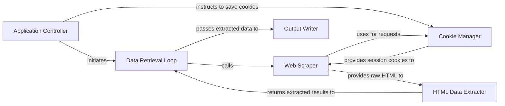

## Details

The `academic-keyword-occurrence` project, a command-line utility for web scraping and data analysis, exhibits a monolithic script architecture with clear functional separation. Based on the CFG and Source analysis, the project's high-level data flow can be described through six core components, each with distinct responsibilities and well-defined interactions.

### Application Controller
The central orchestrator of the application. It parses command-line arguments, initializes the data extraction process, and ensures session cookies are saved upon completion.

**Related Classes/Methods**:

- `Application Controller` (72:92)

### Cookie Manager
Responsible for loading and persisting HTTP cookies, crucial for maintaining session state with Google Scholar and bypassing CAPTCHA challenges.

**Related Classes/Methods**:

- `Cookie Manager` (11:15)
- `Cookie Manager` (92:92)

### Data Retrieval Loop
Manages the iterative process of fetching data for each year within the specified range. It coordinates calls to the Web Scraper and HTML Data Extractor, and passes the processed results to the Output Writer.

**Related Classes/Methods**:

- `Data Retrieval Loop` (50:70)

### Web Scraper
Constructs Google Scholar query URLs, sends HTTP requests, and retrieves the raw HTML content, utilizing managed cookies for session continuity.

**Related Classes/Methods**:

- `Web Scraper` (17:29)

### HTML Data Extractor [[Expand]](./HTML_Data_Extractor.md)
Parses the raw HTML content received from the Web Scraper using BeautifulSoup and regular expressions to accurately extract the numerical count of search results.

**Related Classes/Methods**:

- `HTML Data Extractor` (31:47)

### Output Writer
Formats the extracted year and result count into a CSV string and writes this data to both the specified output file and the console.

**Related Classes/Methods**:

- `Output Writer` (53:57)
- `Output Writer` (65:67)

### [FAQ](https://github.com/CodeBoarding/GeneratedOnBoardings/tree/main?tab=readme-ov-file#faq)