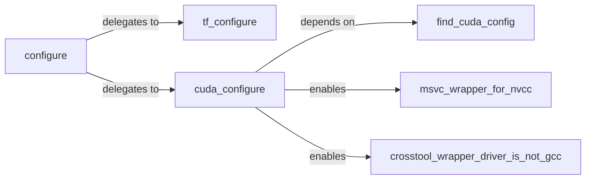

## Details

The addons subsystem is primarily responsible for configuring and building custom TensorFlow operations, particularly those leveraging GPU capabilities. The configure component acts as the central orchestrator, initiating the build process by delegating to tf_configure for TensorFlow-specific setup and cuda_configure for GPU environment detection and configuration. cuda_configure relies on find_cuda_config to locate necessary CUDA tools and enables platform-specific NVCC wrappers like msvc_wrapper_for_nvcc for Windows and crosstool_wrapper_driver_is_not_gcc for Linux/macOS, ensuring the correct compilation of custom C++/CUDA operations across different environments.

### configure
Serves as the orchestrator for the entire build configuration process. It detects the operating system and architecture, retrieves TensorFlow installation paths, and initiates the configuration of the CUDA environment.

**Related Classes/Methods**:

### tf_configure
Manages TensorFlow-specific build processes. This includes generating necessary symlinks and handling pip installations to ensure the project's custom operations are correctly integrated with the installed TensorFlow environment.

**Related Classes/Methods**:

- <a href="https://github.com/tensorflow/addons/blob/master/build_deps/tf_dependency/tf_configure.bzl" target="_blank" rel="noopener noreferrer">`addons.build_deps.tf_dependency.tf_configure`</a>

### cuda_configure
Discovers and configures the CUDA environment. This involves locating CUDA compilers (like NVCC), libraries, and determining the GPU's computing capabilities, which are essential for compiling and running custom C++/CUDA operations.

**Related Classes/Methods**:

- <a href="https://github.com/tensorflow/addons/blob/master/build_deps/toolchains/gpu/BUILD" target="_blank" rel="noopener noreferrer">`addons.build_deps.toolchains.gpu.cuda_configure`</a>

### find_cuda_config
Provides utility functions for precisely locating various CUDA-related files, libraries, and headers across different system configurations, abstracting the complexities of finding CUDA installations.

**Related Classes/Methods**:

- <a href="https://github.com/tensorflow/addons/blob/master/build_deps/toolchains/gpu/BUILD" target="_blank" rel="noopener noreferrer">`addons.build_deps.toolchains.gpu.find_cuda_config`</a>

### msvc_wrapper_for_nvcc
Acts as a wrapper around the NVCC compiler, specifically adapting its invocation for Windows environments using MSVC. It handles command-line options to ensure correct compilation of custom C++/CUDA operations.

**Related Classes/Methods**:

### crosstool_wrapper_driver_is_not_gcc
Acts as a wrapper around the NVCC compiler, adapting its invocation for Linux/macOS environments using Clang. It handles command-line options to ensure correct compilation of custom C++/CUDA operations.

**Related Classes/Methods**:

- <a href="https://github.com/tensorflow/addons/blob/master/build_deps/toolchains/gpu/crosstool/clang/bin/crosstool_wrapper_driver_is_not_gcc.tpl" target="_blank" rel="noopener noreferrer">`addons.build_deps.toolchains.gpu.crosstool.clang.bin.crosstool_wrapper_driver_is_not_gcc`</a>

### [FAQ](https://github.com/CodeBoarding/GeneratedOnBoardings/tree/main?tab=readme-ov-file#faq)