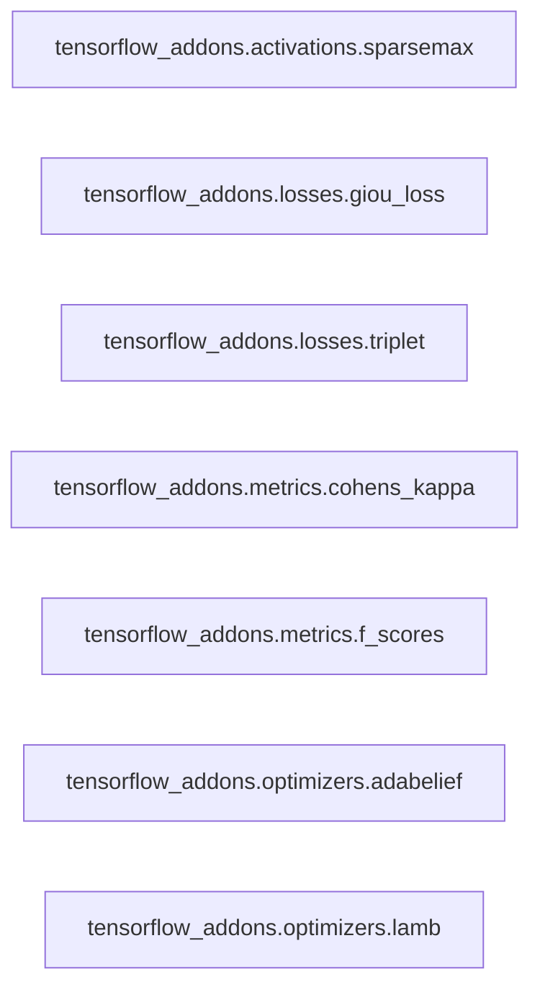

## Details

The Fundamental ML Building Blocks subsystem provides specialized extensions to TensorFlow's core capabilities, organized into distinct functional areas: activations, loss functions, performance metrics, and optimization algorithms.

### tensorflow_addons.activations.sparsemax
Computes the sparsemax activation function, ensuring sparse probability distributions. This is a specialized activation function extending TensorFlow's standard set.

**Related Classes/Methods**:

- <a href="https://github.com/tensorflow/addons/blob/master/tensorflow_addons/activations/sparsemax.py" target="_blank" rel="noopener noreferrer">`tensorflow_addons.activations.sparsemax:_swap_axis`</a>
- <a href="https://github.com/tensorflow/addons/blob/master/tensorflow_addons/activations/sparsemax.py" target="_blank" rel="noopener noreferrer">`tensorflow_addons.activations.sparsemax:_compute_2d_sparsemax`</a>

### tensorflow_addons.losses.giou_loss
Provides the Generalized Intersection over Union (GIoU) loss for robust bounding box regression in object detection tasks. It addresses limitations of standard IoU loss by considering the enclosing box.

**Related Classes/Methods**:

- <a href="https://github.com/tensorflow/addons/blob/master/tensorflow_addons/losses/giou_loss.py" target="_blank" rel="noopener noreferrer">`tensorflow_addons.losses.giou_loss:_calculate_giou`</a>

### tensorflow_addons.losses.triplet
Contains triplet loss functions for metric learning, focusing on learning embeddings where similar items are closer and dissimilar items are further apart by a margin.

**Related Classes/Methods**:

- <a href="https://github.com/tensorflow/addons/blob/master/tensorflow_addons/losses/triplet.py" target="_blank" rel="noopener noreferrer">`tensorflow_addons.losses.triplet:_masked_minimum`</a>
- <a href="https://github.com/tensorflow/addons/blob/master/tensorflow_addons/losses/triplet.py" target="_blank" rel="noopener noreferrer">`tensorflow_addons.losses.triplet:_masked_maximum`</a>

### tensorflow_addons.metrics.cohens_kappa
Computes Cohen's Kappa, a statistical measure of inter-rater agreement for categorical items, which is more robust than simple accuracy for imbalanced datasets.

**Related Classes/Methods**:

- <a href="https://github.com/tensorflow/addons/blob/master/tensorflow_addons/metrics/cohens_kappa.py" target="_blank" rel="noopener noreferrer">`tensorflow_addons.metrics.cohens_kappa:_update_confusion_matrix`</a>
- <a href="https://github.com/tensorflow/addons/blob/master/tensorflow_addons/metrics/cohens_kappa.py" target="_blank" rel="noopener noreferrer">`tensorflow_addons.metrics.cohens_kappa:reset_state`</a>

### tensorflow_addons.metrics.f_scores
Provides F-score metrics (e.g., F1-score) for evaluating classification models, particularly useful for imbalanced datasets where precision and recall are critical.

**Related Classes/Methods**:

- <a href="https://github.com/tensorflow/addons/blob/master/tensorflow_addons/metrics/f_scores.py" target="_blank" rel="noopener noreferrer">`tensorflow_addons.metrics.f_scores:_weighted_sum`</a>
- <a href="https://github.com/tensorflow/addons/blob/master/tensorflow_addons/metrics/f_scores.py" target="_blank" rel="noopener noreferrer">`tensorflow_addons.metrics.f_scores:reset_state`</a>

### tensorflow_addons.optimizers.adabelief
Implements the AdaBelief optimizer, an adaptive learning rate algorithm that combines the benefits of Adam and RMSprop with improved stability.

**Related Classes/Methods**:

- <a href="https://github.com/tensorflow/addons/blob/master/tensorflow_addons/optimizers/adabelief.py" target="_blank" rel="noopener noreferrer">`tensorflow_addons.optimizers.adabelief:_resource_apply_dense`</a>
- <a href="https://github.com/tensorflow/addons/blob/master/tensorflow_addons/optimizers/adabelief.py" target="_blank" rel="noopener noreferrer">`tensorflow_addons.optimizers.adabelief:_resource_apply_sparse`</a>

### tensorflow_addons.optimizers.lamb
Provides the LAMB (Layer-wise Adaptive Moments optimizer for Batching) optimizer, specifically optimized for training deep learning models with very large batch sizes.

**Related Classes/Methods**:

- <a href="https://github.com/tensorflow/addons/blob/master/tensorflow_addons/optimizers/lamb.py" target="_blank" rel="noopener noreferrer">`tensorflow_addons.optimizers.lamb:_resource_apply_dense`</a>
- <a href="https://github.com/tensorflow/addons/blob/master/tensorflow_addons/optimizers/lamb.py" target="_blank" rel="noopener noreferrer">`tensorflow_addons.optimizers.lamb:_do_layer_adaptation`</a>

### [FAQ](https://github.com/CodeBoarding/GeneratedOnBoardings/tree/main?tab=readme-ov-file#faq)