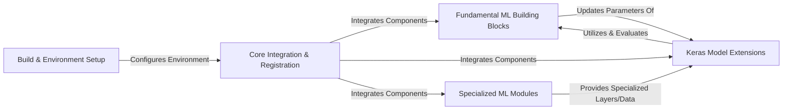

## Details

The TensorFlow Addons project is structured around extending TensorFlow's core capabilities with specialized functionalities. The `Build & Environment Setup` component forms the foundation, managing the compilation and configuration necessary for the entire library, especially for custom C++/CUDA operations. This setup enables the `Core Integration & Registration` component, which provides the essential utilities and mechanisms for making custom components discoverable and usable within the TensorFlow ecosystem. Building upon this core, `Fundamental ML Building Blocks` offers a suite of advanced machine learning primitives like custom activations, losses, metrics, and optimizers. These blocks are extensively utilized by `Keras Model Extensions`, which introduces specialized neural network layers and callbacks to enhance Keras models. Finally, `Specialized ML Modules` provides domain-specific functionalities for image processing, natural language processing, and sequential data, often leveraging and extending the capabilities provided by the other components. This modular design ensures extensibility and clear separation of concerns, facilitating both development and integration into larger machine learning workflows.

### Build & Environment Setup [[Expand]](./Build_Environment_Setup.md)
Manages the project's build processes, including dependency resolution (especially for CUDA/GPU components) and environment configuration. It handles the compilation of custom C++/CUDA operations, ensuring compatibility and performance.

**Related Classes/Methods**:

- <a href="https://github.com/tensorflow/addons/blob/master/configure.py" target="_blank" rel="noopener noreferrer">`configure.py`</a>
- <a href="https://github.com/tensorflow/addons/blob/master/build_deps/tf_dependency/" target="_blank" rel="noopener noreferrer">`build_deps/tf_dependency/`</a>
- <a href="https://github.com/tensorflow/addons/blob/master/build_deps/toolchains/" target="_blank" rel="noopener noreferrer">`build_deps/toolchains/`</a>

### Core Integration & Registration
Provides foundational utilities and mechanisms for integrating custom components within the TensorFlow ecosystem, ensuring they are discoverable and usable by TensorFlow's core APIs. This component also includes general-purpose utility functions used across the library for seamless operation.

**Related Classes/Methods**:

- <a href="https://github.com/tensorflow/addons/blob/master/tensorflow_addons/__init__.py" target="_blank" rel="noopener noreferrer">`tensorflow_addons/__init__.py`</a>
- <a href="https://github.com/tensorflow/addons/blob/master/tensorflow_addons/utils/" target="_blank" rel="noopener noreferrer">`tensorflow_addons/utils/`</a>

### Fundamental ML Building Blocks [[Expand]](./Fundamental_ML_Building_Blocks.md)
Implements fundamental machine learning building blocks such as specialized activation functions, custom loss functions, performance metrics, and advanced optimization algorithms. These components extend TensorFlow's core capabilities for model training and evaluation.

**Related Classes/Methods**:

- <a href="https://github.com/tensorflow/addons/blob/master/tensorflow_addons/activations/" target="_blank" rel="noopener noreferrer">`tensorflow_addons/activations/`</a>
- <a href="https://github.com/tensorflow/addons/blob/master/tensorflow_addons/losses/" target="_blank" rel="noopener noreferrer">`tensorflow_addons/losses/`</a>
- <a href="https://github.com/tensorflow/addons/blob/master/tensorflow_addons/metrics/" target="_blank" rel="noopener noreferrer">`tensorflow_addons/metrics/`</a>
- <a href="https://github.com/tensorflow/addons/blob/master/tensorflow_addons/optimizers/" target="_blank" rel="noopener noreferrer">`tensorflow_addons/optimizers/`</a>

### Keras Model Extensions
Contains a variety of unique and specialized neural network layers that extend Keras's built-in capabilities, such as Conditional Random Field (CRF) layers, unpooling, and various normalization techniques, providing advanced model building blocks. It also includes custom callback functions for monitoring and controlling the training process.

**Related Classes/Methods**:

- <a href="https://github.com/tensorflow/addons/blob/master/tensorflow_addons/layers/" target="_blank" rel="noopener noreferrer">`tensorflow_addons/layers/`</a>
- <a href="https://github.com/tensorflow/addons/blob/master/tensorflow_addons/callbacks/" target="_blank" rel="noopener noreferrer">`tensorflow_addons/callbacks/`</a>

### Specialized ML Modules [[Expand]](./Specialized_ML_Modules.md)
Offers domain-specific functionalities for image processing, natural language processing, and sequential data handling. This includes image transformations, text-specific operations (like CRF for sequence labeling), and custom Recurrent Neural Network (RNN) cells and sequence-to-sequence components.

**Related Classes/Methods**:

- <a href="https://github.com/tensorflow/addons/blob/master/tensorflow_addons/image/" target="_blank" rel="noopener noreferrer">`tensorflow_addons/image/`</a>
- <a href="https://github.com/tensorflow/addons/blob/master/tensorflow_addons/text/" target="_blank" rel="noopener noreferrer">`tensorflow_addons/text/`</a>
- <a href="https://github.com/tensorflow/addons/blob/master/tensorflow_addons/rnn/" target="_blank" rel="noopener noreferrer">`tensorflow_addons/rnn/`</a>
- <a href="https://github.com/tensorflow/addons/blob/master/tensorflow_addons/seq2seq/" target="_blank" rel="noopener noreferrer">`tensorflow_addons/seq2seq/`</a>

### [FAQ](https://github.com/CodeBoarding/GeneratedOnBoardings/tree/main?tab=readme-ov-file#faq)