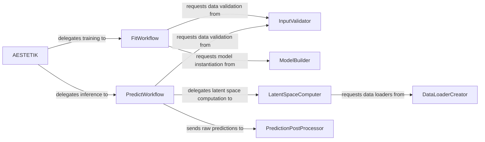

## Details

The AESTETIK library is structured around a central `AESTETIK` orchestrator, which provides the primary user interface for managing the entire workflow from data input to model output. It delegates core functionalities to specialized components for data handling, model construction, and prediction processing. The `FitWorkflow` and `PredictWorkflow` represent the high-level training and inference processes, both orchestrated by the `AESTETIK` class. Data validation is handled by the `InputValidator`, while the `ModelBuilder` is responsible for setting up the deep learning architecture. Data preparation for the model is managed by the `DataLoaderCreator`, and the `LatentSpaceComputer` extracts meaningful representations. Finally, the `PredictionPostProcessor` refines and formats the model's raw outputs for user interpretation.

### AESTETIK
The primary user interface for the AESTETIK library, managing the overall workflow from data input to model output. It orchestrates the data pipeline, model training, and inference via fit() and predict() methods.

**Related Classes/Methods**:

- <a href="https://github.com/ratschlab/aestetik/blob/main/src/aestetik/AESTETIK.py#L22-L492" target="_blank" rel="noopener noreferrer">`aestetik.AESTETIK`:22-492</a>

### FitWorkflow
Manages the complete training lifecycle of the deep learning model, including data validation, model construction, and parameter configuration specific to the training phase.

**Related Classes/Methods**:

- <a href="https://github.com/ratschlab/aestetik/blob/main/src/aestetik/AESTETIK.py#L177-L226" target="_blank" rel="noopener noreferrer">`aestetik.AESTETIK.fit`:177-226</a>

### PredictWorkflow
Oversees the inference process, handling input validation, parameter setup, latent space computation, and post-processing of predictions.

**Related Classes/Methods**:

- <a href="https://github.com/ratschlab/aestetik/blob/main/src/aestetik/AESTETIK.py#L228-L270" target="_blank" rel="noopener noreferrer">`aestetik.AESTETIK.predict`:228-270</a>

### InputValidator
Ensures the integrity, correctness, and adherence to required formats for all input data, both for training and prediction, preventing common data-related errors.

**Related Classes/Methods**:

- <a href="https://github.com/ratschlab/aestetik/blob/main/src/aestetik/data_modules/data_module.py#L11-L129" target="_blank" rel="noopener noreferrer">`aestetik.data_modules.data_module.AestetikDataModule`:11-129</a>

### ModelBuilder
Instantiates and configures the underlying deep learning autoencoder model architecture, preparing it for training or inference.

**Related Classes/Methods**:

- <a href="https://github.com/ratschlab/aestetik/blob/main/src/aestetik/models/model.py" target="_blank" rel="noopener noreferrer">`aestetik.models.model.Model`</a>

### DataLoaderCreator
Prepares and formats raw input data into efficient data loaders suitable for batch processing by the deep learning model, optimizing data flow.

**Related Classes/Methods**:

- <a href="https://github.com/ratschlab/aestetik/blob/main/src/aestetik/dataloader.py" target="_blank" rel="noopener noreferrer">`aestetik.dataloader.AestetikDataLoader`</a>

### LatentSpaceComputer
Computes the compressed, meaningful latent space representations of the input spatial transcriptomics data using the trained model.

**Related Classes/Methods**:

- <a href="https://github.com/ratschlab/aestetik/blob/main/src/aestetik/modules/aestetik_module.py" target="_blank" rel="noopener noreferrer">`aestetik.modules.aestetik_module.AestetikModule`</a>

### PredictionPostProcessor
Finalizes, calibrates, and formats the raw outputs from the model (e.g., latent space, predictions) into a user-friendly structure, making results interpretable.

**Related Classes/Methods**:

- <a href="https://github.com/ratschlab/aestetik/blob/main/src/aestetik/utils/utils_data.py" target="_blank" rel="noopener noreferrer">`aestetik.utils.utils_data`</a>

### [FAQ](https://github.com/CodeBoarding/GeneratedOnBoardings/tree/main?tab=readme-ov-file#faq)