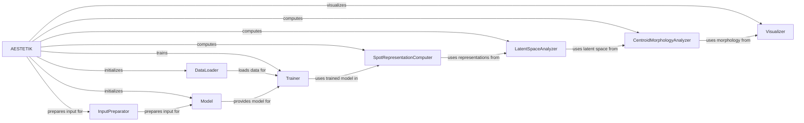

## Component Details

The AESTETIK class orchestrates the entire workflow for analyzing spatial gene expression data. It handles data loading and preprocessing, model initialization and training, latent space analysis, and visualization. The process begins with initializing the data loader and model, followed by training the model. After training, the model is used to compute spot representations and latent space embeddings. Finally, centroid morphology is computed and the results are visualized.

### AESTETIK
The central orchestrator component responsible for managing the entire workflow, from data loading and preprocessing to model training, latent space analysis, and visualization. It initializes and connects the other components, defines the training loop, and handles the overall execution of the analysis.
- **Related Classes/Methods**: `aestetik.aestetik.AESTETIK.AESTETIK`

### DataLoader
The DataLoader component is responsible for loading and preprocessing the input data, preparing it for use in model training. It handles tasks such as reading the data from files, normalizing the data, and creating batches for training.
- **Related Classes/Methods**: `aestetik.aestetik.AESTETIK.AESTETIK:_init_data_loader`

### Model
The Model component represents the machine learning model used for analyzing the data. It is responsible for defining the model architecture and providing methods for training the model and making predictions.
- **Related Classes/Methods**: `aestetik.aestetik.AESTETIK.AESTETIK:_init_model`

### Trainer
The Trainer component is responsible for training the machine learning model using the preprocessed data. It iterates over the data, calculates the loss, and updates the model parameters to minimize the loss.
- **Related Classes/Methods**: `aestetik.aestetik.AESTETIK.AESTETIK:train`

### SpotRepresentationComputer
The SpotRepresentationComputer component extracts features from the trained model to compute spot representations. These representations capture the characteristics of individual spots in the data.
- **Related Classes/Methods**: `aestetik.aestetik.AESTETIK.AESTETIK:compute_spot_representations`

### LatentSpaceAnalyzer
The LatentSpaceAnalyzer component computes the latent space representation of the data based on the spot representations. This latent space provides a lower-dimensional representation of the data that captures the underlying structure and relationships between spots.
- **Related Classes/Methods**: `aestetik.aestetik.AESTETIK.AESTETIK:_compute_latent_space`

### CentroidMorphologyAnalyzer
The CentroidMorphologyAnalyzer component computes the centroid morphology, analyzing the shape and structure of the data in the latent space. This analysis provides insights into the spatial organization of the data.
- **Related Classes/Methods**: `aestetik.aestetik.AESTETIK.AESTETIK:_compute_centroid_morphology`

### Visualizer
The Visualizer component generates visualizations of the analysis results, allowing users to explore the data and gain insights into the spatial gene expression patterns.
- **Related Classes/Methods**: `aestetik.aestetik.AESTETIK.AESTETIK:vizualize`

### InputPreparator
The InputPreparator component prepares the input data to be fed into the model. It handles tasks such as formatting the data and ensuring that it is in the correct format for the model.
- **Related Classes/Methods**: `aestetik.aestetik.AESTETIK.AESTETIK:prepare_input_for_model`
