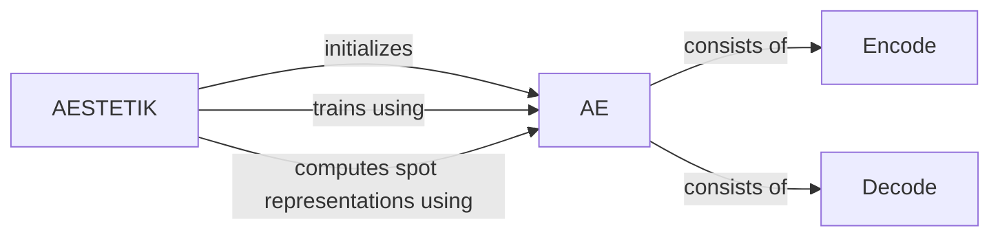

## Component Details

The AESTETIK system leverages an autoencoder model to learn compressed representations of spatial transcriptomics data. The AESTETIK class orchestrates the training and application of the autoencoder. The AE model, composed of Encode and Decode modules, learns a latent space representation capturing the underlying biological structure. During training, the AESTETIK class feeds data to the AE model and optimizes its parameters. After training, the AESTETIK class uses the trained AE model to compute spot representations, enabling downstream analysis and visualization.

### AESTETIK
The main class that orchestrates the training and representation computation. It initializes the AE model, trains it, and uses it to compute spot representations.
- **Related Classes/Methods**: `aestetik.aestetik.AESTETIK`

### AE
The autoencoder model. It defines the architecture for encoding and decoding data. The forward method performs the encoding and decoding steps.
- **Related Classes/Methods**: `aestetik.aestetik.model.AE`

### Encode
The encoder part of the autoencoder model. It maps the high-dimensional gene expression data to a lower-dimensional latent space.
- **Related Classes/Methods**: `aestetik.aestetik.model.Encode`

### Decode
The decoder part of the autoencoder model. It reconstructs the original data from the latent representation.
- **Related Classes/Methods**: `aestetik.aestetik.model.Decode`
