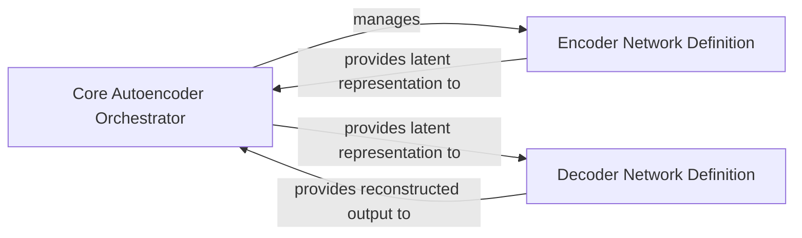

## Details

The Core Autoencoder Orchestrator serves as the central control unit for the autoencoding process. It is responsible for the lifecycle management of the Encoder Network Definition, initiating its operation and receiving the resulting latent representation. Subsequently, the orchestrator provides this latent representation to the Decoder Network Definition, which then reconstructs the input data. The Decoder Network Definition ultimately returns the reconstructed output to the Core Autoencoder Orchestrator. This flow highlights the sequential transformation of data from input to latent space and then to reconstructed output, all managed and coordinated by the central orchestrator.

### Core Autoencoder Orchestrator
This component (aestetik.models.model) acts as the central orchestrator for the entire autoencoding process. It is responsible for initializing the encoder and decoder networks, defining the overall forward pass, and integrating the encoding and decoding steps. In the context of PyTorch Lightning, this typically represents the LightningModule that brings together the sub-modules and defines the model's high-level behavior.

**Related Classes/Methods**:

- <a href="https://github.com/ratschlab/aestetik/blob/main/src/aestetik/models/model.py" target="_blank" rel="noopener noreferrer">`aestetik.models.model`</a>

### Encoder Network Definition
This component (combining aestetik.models.model.Encode and aestetik.models.model.encoder) defines the architectural blueprint and functional execution of the encoder network. It specifies the convolutional layers and structure responsible for transforming high-dimensional input features into a compact, lower-dimensional latent space representation.

**Related Classes/Methods**:

- <a href="https://github.com/ratschlab/aestetik/blob/main/src/aestetik/models/model.py#L8-L26" target="_blank" rel="noopener noreferrer">`aestetik.models.model.Encode`:8-26</a>
- <a href="https://github.com/ratschlab/aestetik/blob/main/src/aestetik/models/model.py#L82-L86" target="_blank" rel="noopener noreferrer">`aestetik.models.model.encoder`:82-86</a>

### Decoder Network Definition
This component (combining aestetik.models.model.Decode and aestetik.models.model.decoder) defines the architectural blueprint and functional execution of the decoder network. It specifies the deconvolutional or upsampling layers and structure responsible for reconstructing the input features from the latent space representation, aiming to approximate the original input.

**Related Classes/Methods**:

- <a href="https://github.com/ratschlab/aestetik/blob/main/src/aestetik/models/model.py#L29-L48" target="_blank" rel="noopener noreferrer">`aestetik.models.model.Decode`:29-48</a>
- <a href="https://github.com/ratschlab/aestetik/blob/main/src/aestetik/models/model.py#L88-L92" target="_blank" rel="noopener noreferrer">`aestetik.models.model.decoder`:88-92</a>

### [FAQ](https://github.com/CodeBoarding/GeneratedOnBoardings/tree/main?tab=readme-ov-file#faq)