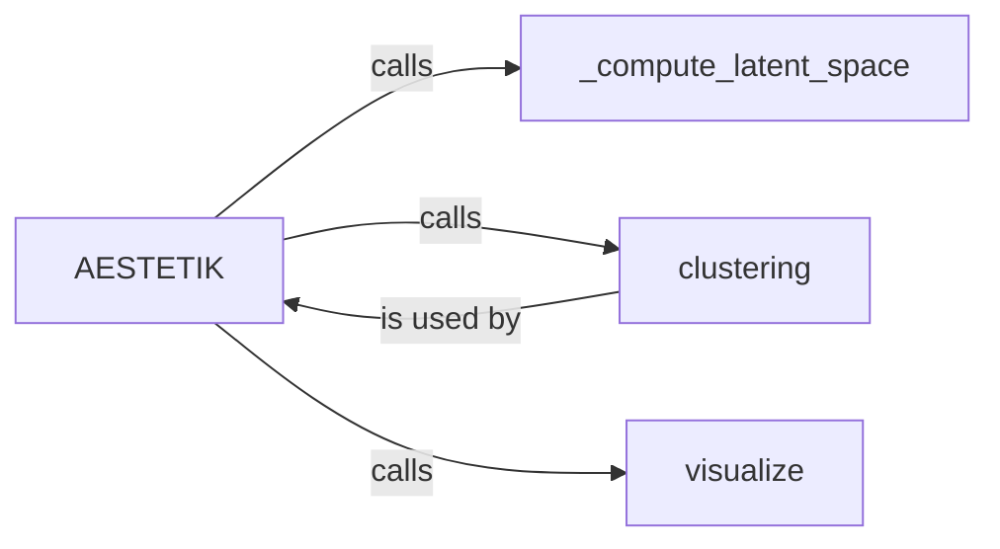

## Component Details

The Latent Space Analyzer component focuses on understanding the structure of the learned latent space in AESTETIK. It encompasses dimensionality reduction, clustering, and visualization techniques to enable users to explore and interpret the latent representations. The main flow involves computing the latent space, clustering data points within this space, and then visualizing the resulting clusters to identify patterns or groupings, such as cell types or spatial domains. This analysis helps in gaining insights from complex data by representing it in a simplified, interpretable format.

### AESTETIK
The central class orchestrating the entire AESTETIK process. It manages the computation of the latent space, performs clustering on the latent representations, and visualizes the results. It serves as the entry point and coordinator for the latent space analysis workflow.
- **Related Classes/Methods**: `aestetik.aestetik.AESTETIK.AESTETIK`

### _compute_latent_space
This method is responsible for calculating the latent space representation of the input data. It employs dimensionality reduction techniques or pre-trained models to transform the high-dimensional data into a lower-dimensional space, capturing the essential features and relationships within the data.
- **Related Classes/Methods**: `aestetik.aestetik.AESTETIK.AESTETIK:_compute_latent_space`

### clustering
This function applies clustering algorithms to group data points within the latent space. It uses algorithms like k-means or DBSCAN to identify clusters based on the proximity of data points, revealing underlying structures and groupings within the data.
- **Related Classes/Methods**: `aestetik.aestetik.utils.utils_clustering:clustering`

### visualize
This method handles the visualization of the clustered data points in the latent space. It uses plotting libraries to generate scatter plots or other visualizations that display the clusters and their relationships, providing a visual representation of the latent space structure.
- **Related Classes/Methods**: `aestetik.aestetik.AESTETIK.AESTETIK:vizualize`
