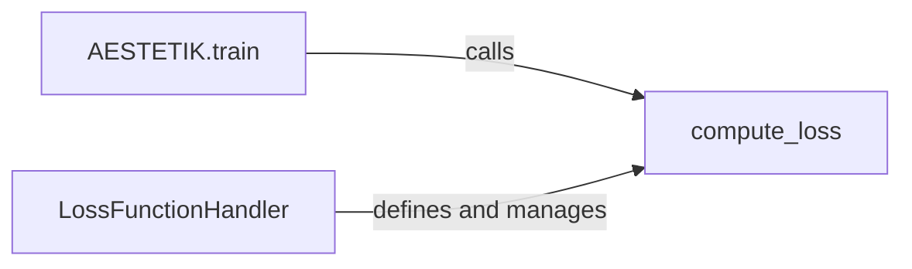

## Component Details

The AESTETIK model training process revolves around minimizing the loss between the original data and its reconstruction. The `LossFunctionHandler` defines and manages the loss function, which is used by the `compute_loss` function to calculate the loss. The `train` method orchestrates the training loop, utilizing `compute_loss` to evaluate the model's performance and update its parameters. Regularization terms can be incorporated into the loss function to improve the quality of the learned latent space.

### AESTETIK.train
The `train` method is the core of the training process. It iterates through the training dataset, feeding data to the autoencoder model. For each batch, it calls the `compute_loss` function to determine the loss between the original input and the reconstructed output. Based on this loss, the model's parameters are updated using an optimization algorithm (e.g., gradient descent) to minimize the loss. This iterative process continues until the model converges or a maximum number of epochs is reached.
- **Related Classes/Methods**: `aestetik.aestetik.AESTETIK.AESTETIK`

### compute_loss
The `compute_loss` function is responsible for calculating the loss between the model's predictions (reconstructed data) and the original input data. It leverages the loss function defined and managed by the `LossFunctionHandler`. This function may incorporate various loss terms, such as reconstruction loss (measuring the difference between input and output), regularization terms (penalizing complex models), or other constraints to guide the learning process. The calculated loss value is then used to update the model's parameters during training.
- **Related Classes/Methods**: `aestetik.aestetik.loss_function`

### LossFunctionHandler
The `LossFunctionHandler` defines and manages the loss function used to train the autoencoder model. It encapsulates the logic for calculating the difference between the original data and the reconstructed data, guiding the learning process. It may incorporate reconstruction loss, regularization terms, or other constraints to improve the quality of the learned latent space. The handler provides a consistent interface for the `compute_loss` function to access and utilize the defined loss function.
- **Related Classes/Methods**: `aestetik.aestetik.loss_function`
