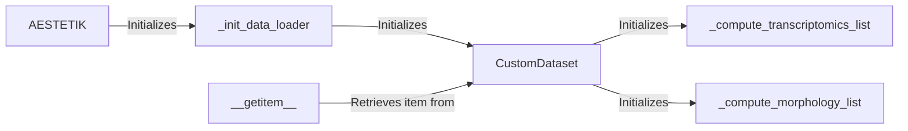

## Component Details

The AESTETIK system focuses on loading, processing, and managing spatial transcriptomics data for downstream analysis, particularly using an autoencoder model. The core flow involves initializing the AESTETIK class, which then initializes a custom data loader (CustomDataset). The CustomDataset handles the loading and preprocessing of both transcriptomics and morphology data, offering flexibility in data selection based on different criteria. The system computes lists of data based on different criteria and retrieves data items for training or analysis.

### AESTETIK
The main class responsible for initializing the Aestetik model and the data loader. It serves as the entry point for the data processing pipeline.
- **Related Classes/Methods**: `aestetik.aestetik.AESTETIK.AESTETIK`

### _init_data_loader
Initializes the data loader component (CustomDataset) within the AESTETIK class. This step configures the data loading process based on specified parameters.
- **Related Classes/Methods**: `aestetik.aestetik.AESTETIK.AESTETIK:_init_data_loader`

### CustomDataset
A custom dataset class responsible for loading and processing transcriptomics and morphology data. It prepares the data for input to the autoencoder model and provides functionalities for data normalization, feature selection, and batch correction.
- **Related Classes/Methods**: `aestetik.aestetik.dataloader.CustomDataset`

### _compute_transcriptomics_list
Computes a list of transcriptomics data based on specific criteria defined within the CustomDataset class. This function filters and prepares transcriptomics data for subsequent analysis.
- **Related Classes/Methods**: `aestetik.aestetik.dataloader.CustomDataset:_compute_transcriptomics_list`

### _compute_morphology_list
Computes a list of morphology data based on specific criteria defined within the CustomDataset class. This function filters and prepares morphology data for subsequent analysis.
- **Related Classes/Methods**: `aestetik.aestetik.dataloader.CustomDataset:_compute_morphology_list`

### __getitem__
Retrieves a specific item (data sample) from the dataset. This method is crucial for accessing individual data points during training or evaluation.
- **Related Classes/Methods**: `aestetik.aestetik.dataloader.CustomDataset:__getitem__`
