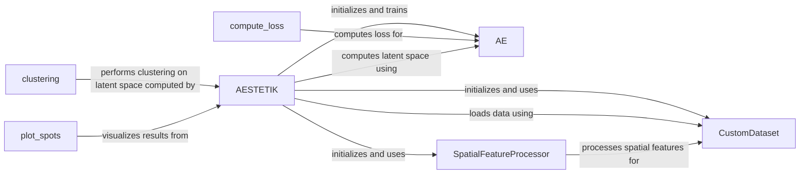

## Component Details

The AESTETIK framework performs spatial transcriptomics analysis by integrating morphology and gene expression data. It uses an autoencoder to learn a latent representation of the data, which is then used for clustering and visualization. The framework consists of several key components, including data loading, model definition, training, and spatial feature processing. The main flow involves loading the data using a custom dataset, training an autoencoder model, computing a latent space representation, performing clustering on the latent space, and visualizing the results. Spatial information is incorporated into the analysis through the SpatialFeatureProcessor, which extracts features from morphology and transcriptomics data.

### AESTETIK
The main class that orchestrates the entire process, including data loading, model initialization, training, latent space computation, and visualization. It initializes and uses the CustomDataset, AE, and SpatialFeatureProcessor components.
- **Related Classes/Methods**: `aestetik.aestetik.AESTETIK.AESTETIK`

### CustomDataset
A custom dataset class responsible for loading and preprocessing spatial transcriptomics data, handling both transcriptomics and morphology information. It is used by the AESTETIK class to load the data and utilizes the SpatialFeatureProcessor to process spatial features.
- **Related Classes/Methods**: `aestetik.aestetik.dataloader.CustomDataset`

### AE
The autoencoder model used to learn latent representations of the input data. It is trained by the AESTETIK class and its loss is computed by the compute_loss function.
- **Related Classes/Methods**: `aestetik.aestetik.model.AE`

### compute_loss
Computes the loss function for training the autoencoder model. It is used during the training of the AE model.
- **Related Classes/Methods**: `aestetik.aestetik.loss_function`

### clustering
Performs clustering on the latent space representations. It operates on the latent space computed by the AESTETIK class.
- **Related Classes/Methods**: `aestetik.aestetik.utils.utils_clustering`

### plot_spots
Visualizes the spatial distribution of spots based on clustering results or other features. It visualizes the results obtained from the AESTETIK class.
- **Related Classes/Methods**: `aestetik.aestetik.utils.utils_vizualization`

### SpatialFeatureProcessor
Provides utilities for processing and analyzing spatial features, including morphology and transcriptomics data. It includes functions for image analysis, feature extraction, and spatial statistics. It allows users to incorporate spatial information into the analysis and identify spatially-dependent gene expression patterns. It is used by the CustomDataset to process spatial features.
- **Related Classes/Methods**: `aestetik.aestetik.utils.utils_morphology`, `aestetik.aestetik.utils.utils_transcriptomics`
