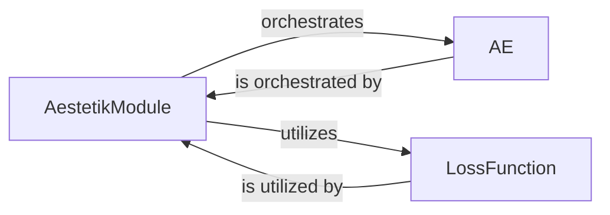

## Details

The Aestetik project's core functionality revolves around an autoencoder architecture implemented using PyTorch Lightning. The `AestetikModule` acts as the central orchestrator, managing the training and inference lifecycle of the `AE` model. It leverages a `LossFunction` to guide the learning process, ensuring the model effectively learns representations from the input data. This modular design promotes clear separation of concerns, with the `AestetikModule` handling the high-level training logic, the `AE` component defining the neural network structure, and the `LossFunction` providing the optimization objective.

### AestetikModule
Encapsulates the core autoencoder model within a PyTorch Lightning `LightningModule`. It defines and orchestrates the training, validation, and test steps, integrates optimizers, manages the overall training and inference loops, applies loss functions and metrics, and handles logging of training progress.

**Related Classes/Methods**:

- <a href="https://github.com/ratschlab/aestetik/blob/main/src/aestetik/modules/aestetik_module.py" target="_blank" rel="noopener noreferrer">`AestetikModule`</a>

### AE
Represents the autoencoder architecture used by the `AestetikModule` to process input data and generate learned representations or predictions. It comprises `Encode` and `Decode` ensembles for robust feature extraction and reconstruction.

**Related Classes/Methods**:

- <a href="https://github.com/ratschlab/aestetik/blob/main/src/aestetik/models/model.py#L51-L97" target="_blank" rel="noopener noreferrer">`AE`:51-97</a>

### LossFunction
Calculates the objective function during training and validation, guiding the model's learning process based on its outputs and target data.

**Related Classes/Methods**:

- <a href="https://github.com/ratschlab/aestetik/blob/main/src/aestetik/metrics/loss_function.py" target="_blank" rel="noopener noreferrer">`LossFunction`</a>

### [FAQ](https://github.com/CodeBoarding/GeneratedOnBoardings/tree/main?tab=readme-ov-file#faq)