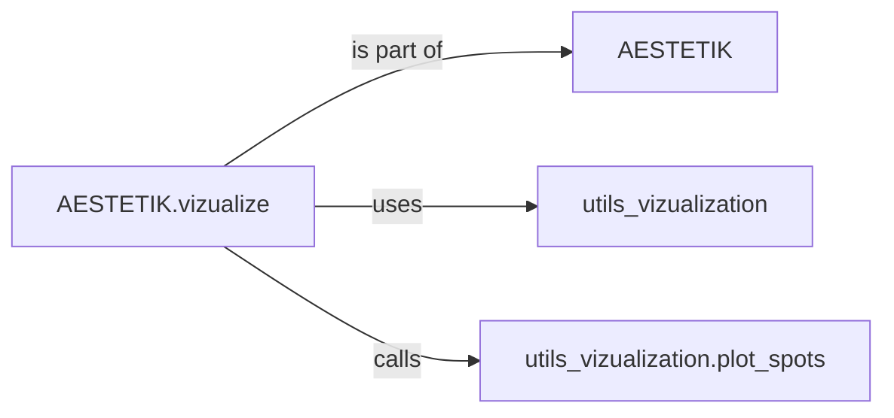

## Component Details

The VisualizationEngine generates visualizations of spatial transcriptomics data, enabling interactive exploration and insights into tissue organization. The core flow starts with the AESTETIK class, which orchestrates the visualization process through its vizualize method. This method leverages utility functions from the utils_vizualization module to create various plots, including spot plots, heatmaps, and interactive visualizations. The plot_spots function specifically handles the rendering of spots on a given visualization. The AESTETIK class serves as the main entry point, while utils_vizualization provides reusable functions for different visualization types.

### AESTETIK
The `AESTETIK` class serves as the main class that encapsulates the visualization functionality. It contains the `vizualize` method and potentially other methods for data processing and visualization configuration. It acts as the entry point for the visualization process.
- **Related Classes/Methods**: `aestetik.aestetik.AESTETIK`

### AESTETIK.vizualize
The `vizualize` method within the `AESTETIK` class is responsible for orchestrating the visualization process. It takes data as input, processes it, and calls other functions to generate the final visualization. It acts as the central control point for the visualization workflow.
- **Related Classes/Methods**: `aestetik.aestetik.AESTETIK.AESTETIK:vizualize`

### utils_vizualization
The `utils_vizualization` module contains utility functions for creating different types of visualizations, including plotting spots, creating heatmaps, and generating interactive plots. It provides a set of reusable functions that can be used by the `AESTETIK.vizualize` method to create various visualizations.
- **Related Classes/Methods**: `aestetik.aestetik.utils.utils_vizualization`

### utils_vizualization.plot_spots
The `plot_spots` function in the `utils_vizualization` module is responsible for plotting spots on a given visualization. It takes the visualization object and spot data as input and renders the spots according to the provided data.
- **Related Classes/Methods**: `aestetik.aestetik.utils.utils_vizualization:plot_spots`
