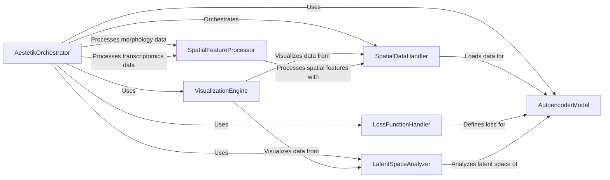

## Component Details

The aestetik project focuses on analyzing spatial transcriptomics data using an autoencoder-based deep learning approach. The core workflow involves loading and preprocessing spatial data, training an autoencoder model to learn latent representations, analyzing the latent space to identify cell types or spatial domains, and visualizing the results. The system is orchestrated by a central component that manages the data flow and interactions between different modules.

### AestetikOrchestrator
The central orchestrator component responsible for managing the entire workflow, from data loading and preprocessing to model training, latent space analysis, and visualization. It initializes and connects the other components, defines the training loop, and handles the overall execution of the analysis.
- **Related Classes/Methods**: `aestetik.aestetik.AESTETIK.AESTETIK`

### SpatialDataHandler
Handles the loading, preprocessing, and management of spatial transcriptomics data. It is responsible for reading the data from various file formats, performing quality control, and preparing the data for input to the autoencoder model. It provides functionalities for data normalization, feature selection, and batch correction.
- **Related Classes/Methods**: `aestetik.aestetik.dataloader.CustomDataset`

### AutoencoderModel
The core deep learning model consisting of an encoder and decoder. It learns a compressed latent representation of the spatial transcriptomics data, capturing the underlying biological structure and relationships. The encoder maps the high-dimensional gene expression data to a lower-dimensional latent space, while the decoder reconstructs the original data from the latent representation.
- **Related Classes/Methods**: `aestetik.aestetik.model.AE`, `aestetik.aestetik.model.Encode`, `aestetik.aestetik.model.Decode`

### LossFunctionHandler
Defines and manages the loss function used to train the autoencoder model. It calculates the difference between the original data and the reconstructed data, guiding the learning process. It may incorporate reconstruction loss, regularization terms, or other constraints to improve the quality of the learned latent space.
- **Related Classes/Methods**: `aestetik.aestetik.loss_function`

### LatentSpaceAnalyzer
Provides functionalities for analyzing the learned latent space. It includes methods for dimensionality reduction, clustering, and visualization of the latent representations. It allows users to explore the structure of the latent space and identify distinct cell types or spatial domains.
- **Related Classes/Methods**: `aestetik.aestetik.utils.utils_clustering`

### VisualizationEngine
Generates visualizations of the spatial transcriptomics data and the results of the analysis. It creates plots of gene expression patterns, latent space representations, and cluster assignments. It allows users to interactively explore the data and gain insights into the spatial organization of the tissue.
- **Related Classes/Methods**: `aestetik.aestetik.utils.utils_vizualization`

### SpatialFeatureProcessor
Provides utilities for processing and analyzing spatial features, including morphology and transcriptomics data. It includes functions for image analysis, feature extraction, and spatial statistics. It allows users to incorporate spatial information into the analysis and identify spatially-dependent gene expression patterns.
- **Related Classes/Methods**: `aestetik.aestetik.utils.utils_morphology`, `aestetik.aestetik.utils.utils_transcriptomics`