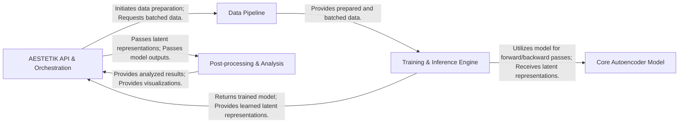

## Details

The AESTETIK library is structured around a clear data flow, starting with the `AESTETIK API & Orchestration` component, which serves as the central control point. This component initiates the data preparation process by interacting with the `Data Pipeline`. The `Data Pipeline` is responsible for loading, preprocessing, and batching spatial transcriptomics and morphology data, providing it in a consumable format to the `Training & Inference Engine`. The `Training & Inference Engine` then utilizes the `Core Autoencoder Model` for both training and inference, managing the deep learning workflow and generating latent space representations. Finally, the `AESTETIK API & Orchestration` component passes these representations and model outputs to the `Post-processing & Analysis` component, which performs clustering and visualization to derive biological insights.

### AESTETIK API & Orchestration [[Expand]](./AESTETIK_API_Orchestration.md)
The primary user interface for the AESTETIK library, managing the overall workflow from data input to model output. It orchestrates the data pipeline, model training, and inference via `fit()` and `predict()` methods.

**Related Classes/Methods**:

- <a href="https://github.com/ratschlab/aestetik/blob/main/src/aestetik/AESTETIK.py" target="_blank" rel="noopener noreferrer">`src/aestetik/AESTETIK.py`</a>

### Data Pipeline [[Expand]](./Data_Pipeline.md)
Responsible for the entire data handling process, from initial loading and preprocessing of raw spatial transcriptomics and morphology data (including grid construction and normalization) to efficient batching and augmentation for model consumption.

**Related Classes/Methods**:

- <a href="https://github.com/ratschlab/aestetik/blob/main/src/aestetik/utils/utils_data.py" target="_blank" rel="noopener noreferrer">`src/aestetik/utils/utils_data.py`</a>
- <a href="https://github.com/ratschlab/aestetik/blob/main/src/aestetik/utils/utils_grid.py" target="_blank" rel="noopener noreferrer">`src/aestetik/utils/utils_grid.py`</a>
- <a href="https://github.com/ratschlab/aestetik/blob/main/src/aestetik/dataloader.py" target="_blank" rel="noopener noreferrer">`src/aestetik/dataloader.py`</a>
- <a href="https://github.com/ratschlab/aestetik/blob/main/src/aestetik/data_modules/data_module.py" target="_blank" rel="noopener noreferrer">`src/aestetik/data_modules/data_module.py`</a>

### Core Autoencoder Model [[Expand]](./Core_Autoencoder_Model.md)
Implements the deep learning architecture, specifically the convolutional autoencoder. It encompasses both the Encoder (for learning compact latent space representations) and the Decoder (for reconstructing input features).

**Related Classes/Methods**:

- <a href="https://github.com/ratschlab/aestetik/blob/main/src/aestetik/models/model.py" target="_blank" rel="noopener noreferrer">`src/aestetik/models/model.py`</a>

### Training & Inference Engine [[Expand]](./Training_Inference_Engine.md)
Encapsulates the core autoencoder model within a PyTorch Lightning `LightningModule`. It defines the training, validation, and test steps, integrates optimizers, manages the overall training and inference loops, and applies loss functions and metrics.

**Related Classes/Methods**:

- <a href="https://github.com/ratschlab/aestetik/blob/main/src/aestetik/modules/aestetik_module.py" target="_blank" rel="noopener noreferrer">`src/aestetik/modules/aestetik_module.py`</a>
- <a href="https://github.com/ratschlab/aestetik/blob/main/src/aestetik/metrics/loss_function.py" target="_blank" rel="noopener noreferrer">`src/aestetik/metrics/loss_function.py`</a>

### Post-processing & Analysis
Handles downstream tasks after model inference, including applying clustering algorithms to the learned latent space representations to identify distinct spatial domains or cell types, and providing utilities for visualizing results.

**Related Classes/Methods**:

- <a href="https://github.com/ratschlab/aestetik/blob/main/src/aestetik/utils/utils_clustering.py" target="_blank" rel="noopener noreferrer">`src/aestetik/utils/utils_clustering.py`</a>
- <a href="https://github.com/ratschlab/aestetik/blob/main/src/aestetik/utils/utils_visualization.py" target="_blank" rel="noopener noreferrer">`src/aestetik/utils/utils_visualization.py`</a>

### [FAQ](https://github.com/CodeBoarding/GeneratedOnBoardings/tree/main?tab=readme-ov-file#faq)