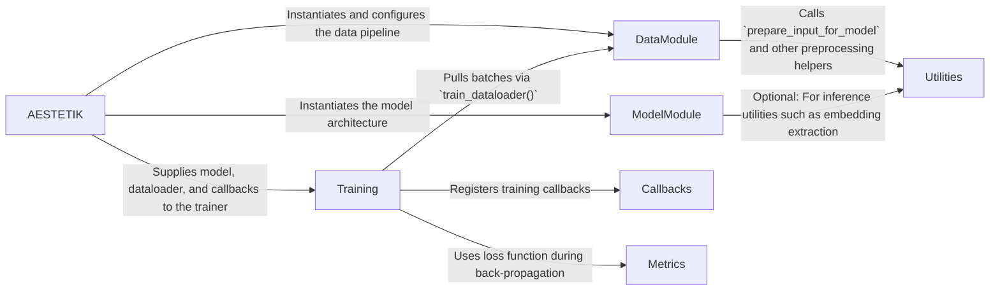

## Details

AESTETIK is a lightweight, Lightning‑based framework that orchestrates multimodal single‑cell analysis. At runtime, the orchestrator (`AESTETIK`) constructs a **DataModule** that ingests an `anndata` object, applies modality‑specific preprocessing (via utilities), and exposes a PyTorch `DataLoader`. Simultaneously, the orchestrator creates a **ModelModule** that encapsulates the neural architecture. These two objects are handed to the **Training** component, a `Lightning Trainer` enriched with custom callbacks and loss functions. The trainer drives the learning loop, consuming batches from the data module, applying the loss, and updating the model. Throughout this pipeline, the **Utilities** package supplies reusable helpers for clustering, grid construction, and visualization, ensuring a clean separation of concerns. The resulting architecture is modular, testable, and easily visualized as a flow diagram with five primary components and well‑defined data‑flow arrows.

### AESTETIK
Public API – exposes `fit`, `predict`, and `fit_predict`. Instantiates the data module, model, trainer, and wires callbacks.

**Related Classes/Methods**:

- <a href="https://github.com/ratschlab/aestetik/blob/main/src/aestetik/AESTETIK.py" target="_blank" rel="noopener noreferrer">`src/aestetik/AESTETIK.py`</a>

### DataModule
Handles data ingestion, preprocessing, and dataloader creation. Uses utilities to compute weights and build the dataset.

**Related Classes/Methods**:

- <a href="https://github.com/ratschlab/aestetik/blob/main/src/aestetik/data_modules/data_module.py" target="_blank" rel="noopener noreferrer">`src/aestetik/data_modules/data_module.py`</a>

### ModelModule
Implements the neural‑network architecture and forward logic.

**Related Classes/Methods**:

- <a href="https://github.com/ratschlab/aestetik/blob/main/src/aestetik/modules/aestetik_module.py" target="_blank" rel="noopener noreferrer">`src/aestetik/modules/aestetik_module.py`</a>

### Training
Lightning trainer + callbacks + loss functions. Handles training loop, checkpointing, early‑stopping, and logging.

**Related Classes/Methods**:

- <a href="https://github.com/ratschlab/aestetik/blob/main/src/aestetik/callbacks/callbacks.py" target="_blank" rel="noopener noreferrer">`src/aestetik/callbacks/callbacks.py`</a>
- <a href="https://github.com/ratschlab/aestetik/blob/main/src/aestetik/metrics/loss_function.py" target="_blank" rel="noopener noreferrer">`src/aestetik/metrics/loss_function.py`</a>

### Utilities
Generic helpers (pre‑processing, clustering, grid construction, visualization).

**Related Classes/Methods**:

- <a href="https://github.com/ratschlab/aestetik/blob/main/src/aestetik/utils/" target="_blank" rel="noopener noreferrer">`src/aestetik/utils/*.py`</a>

### [FAQ](https://github.com/CodeBoarding/GeneratedOnBoardings/tree/main?tab=readme-ov-file#faq)