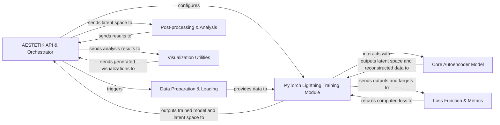

## Details

The AESTETIK library orchestrates a comprehensive spatial transcriptomics analysis pipeline. It begins with the `AESTETIK API & Orchestrator` initiating `Data Preparation & Loading` to process raw data, including calibration and grid construction. This prepared data is then fed into the `PyTorch Lightning Training Module`, which encapsulates the `Core Autoencoder Model` (comprising encoder and decoder) and interacts with `Loss Function & Metrics` during training. After training, the `AESTETIK API & Orchestrator` retrieves the trained model and latent space, passing the latter to `Post-processing & Analysis` for clustering. Finally, the results are channeled to `Visualization Utilities` to generate insightful plots, completing the analytical workflow.

### AESTETIK API & Orchestrator
The central control unit, managing the entire AESTETIK workflow from data input to result visualization. It provides the user interface and coordinates interactions between all other components.

**Related Classes/Methods**:

- <a href="https://github.com/ratschlab/aestetik/blob/main/src/aestetik/AESTETIK.py#L22-L492" target="_blank" rel="noopener noreferrer">`aestetik.AESTETIK`:22-492</a>

### Data Preparation & Loading
Responsible for ingesting raw spatial transcriptomics data, performing necessary preprocessing steps (e.g., calibration, grid building), and creating efficient data loaders for model consumption.

**Related Classes/Methods**:

- <a href="https://github.com/ratschlab/aestetik/blob/main/src/aestetik/utils/utils_data.py" target="_blank" rel="noopener noreferrer">`aestetik.utils.utils_data`</a>
- <a href="https://github.com/ratschlab/aestetik/blob/main/src/aestetik/dataloader.py" target="_blank" rel="noopener noreferrer">`aestetik.dataloader`</a>

### Core Autoencoder Model
Implements the autoencoder neural network architecture, consisting of an encoder for dimensionality reduction and a decoder for data reconstruction. This is the core machine learning component.

**Related Classes/Methods**:

- <a href="https://github.com/ratschlab/aestetik/blob/main/src/aestetik/models/model.py" target="_blank" rel="noopener noreferrer">`aestetik.models.model`</a>

### PyTorch Lightning Training Module
Encapsulates the `Core Autoencoder Model` within the PyTorch Lightning framework, handling training, validation, and testing loops, and integrating with optimization and loss calculation.

**Related Classes/Methods**:

- <a href="https://github.com/ratschlab/aestetik/blob/main/src/aestetik/modules/aestetik_module.py" target="_blank" rel="noopener noreferrer">`aestetik.modules.aestetik_module`</a>

### Loss Function & Metrics
Provides the mathematical functions (e.g., reconstruction loss, triplet loss) used to guide the autoencoder's learning process and evaluate its performance.

**Related Classes/Methods**:

- <a href="https://github.com/ratschlab/aestetik/blob/main/src/aestetik/metrics/loss_function.py" target="_blank" rel="noopener noreferrer">`aestetik.metrics.loss_function`</a>

### Post-processing & Analysis
Performs downstream analysis on the latent space generated by the autoencoder, primarily focusing on clustering to identify biological patterns.

**Related Classes/Methods**:

- <a href="https://github.com/ratschlab/aestetik/blob/main/src/aestetik/utils/utils_clustering.py" target="_blank" rel="noopener noreferrer">`aestetik.utils.utils_clustering`</a>

### Visualization Utilities
Generates various plots and visual representations of the AESTETIK analysis results, aiding in the interpretation of biological insights.

**Related Classes/Methods**:

- <a href="https://github.com/ratschlab/aestetik/blob/main/src/aestetik/utils/utils_visualization.py" target="_blank" rel="noopener noreferrer">`aestetik.utils.utils_visualization`</a>

### [FAQ](https://github.com/CodeBoarding/GeneratedOnBoardings/tree/main?tab=readme-ov-file#faq)