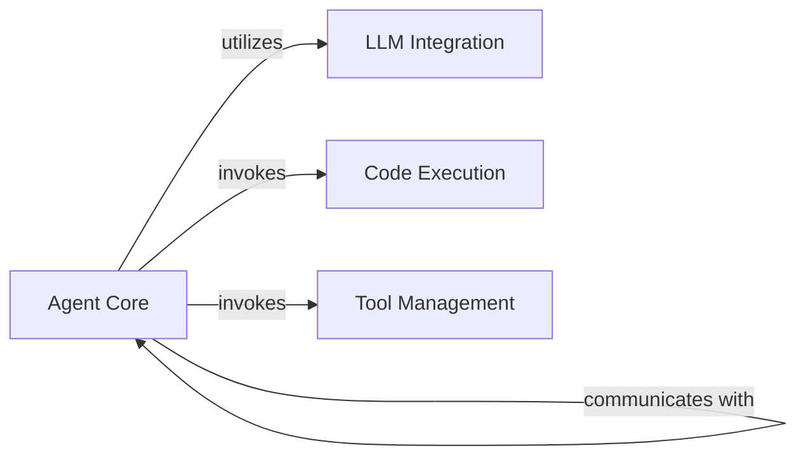

## Details

The `Agent Core` subsystem is primarily defined by the `autogen.agentchat.conversable_agent.ConversableAgent` class, which serves as the central intelligence and control unit for all agents within the system. The `Agent Core` subsystem encompasses the `ConversableAgent` and its direct, essential dependencies that enable its core functionalities: LLM interaction, code execution, and external tool utilization.

### Agent Core [[Expand]](./Agent_Core.md)
The foundational and central intelligence unit for all agents. It manages core conversational logic, maintains agent state, processes incoming and outgoing messages, and orchestrates reply generation. It provides the essential framework for agents to engage in conversations, manage chat history, and handle conversation termination. It also offers extensible hooks for custom reply functions and specialized behaviors.

**Related Classes/Methods**:

- <a href="https://github.com/ag2ai/ag2/blob/main/autogen/agentchat/conversable_agent.py#L127-L4055" target="_blank" rel="noopener noreferrer">`autogen.agentchat.conversable_agent.ConversableAgent`:127-4055</a>

### LLM Integration
Provides the interface for `ConversableAgent` to interact with OpenAI-compatible Large Language Models (LLMs). It abstracts the complexities of LLM API calls, enabling agents to generate natural language responses.

**Related Classes/Methods**:

- <a href="https://github.com/ag2ai/ag2/blob/main/autogen/oai/client.py#L339-L718" target="_blank" rel="noopener noreferrer">`autogen.oai.client.OpenAIClient`:339-718</a>

### Code Execution
An abstract component that `ConversableAgent` delegates to for executing code snippets. This enables agents to perform computational tasks, run scripts, and interact with various execution environments (e.g., local shell, Jupyter).

**Related Classes/Methods**:

- <a href="https://github.com/ag2ai/ag2/blob/main/autogen/coding/base.py#L56-L86" target="_blank" rel="noopener noreferrer">`autogen.coding.base.CodeExecutor`:56-86</a>

### Tool Management
Represents external functions or capabilities that `ConversableAgent` can discover, manage, and invoke. This component enables agents to extend their functionality beyond internal logic by interacting with external services or custom functions.

**Related Classes/Methods**:

- <a href="https://github.com/ag2ai/ag2/blob/main/autogen/tools/tool.py#L172-L187" target="_blank" rel="noopener noreferrer">`autogen.tools.tool.Tool`:172-187</a>

### [FAQ](https://github.com/CodeBoarding/GeneratedOnBoardings/tree/main?tab=readme-ov-file#faq)