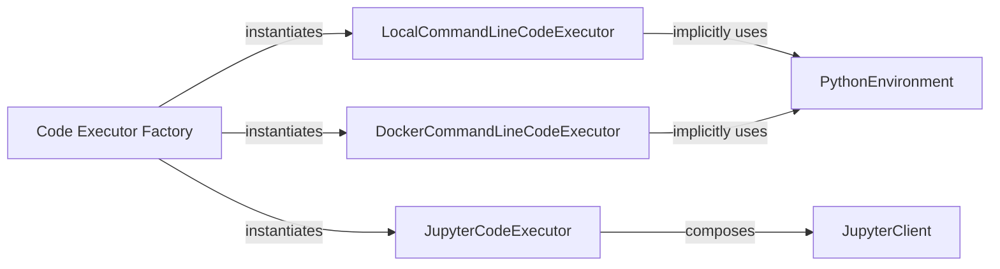

## Details

The `Code Execution Environments` subsystem in `autogen` is primarily defined by the `autogen.coding` and `autogen.environments` packages. It encompasses components responsible for providing secure and isolated environments for agents to execute code, supporting various programming languages and execution paradigms (e.g., command-line, interactive Jupyter, local, Docker).

### PythonEnvironment
Defines the abstract interface for managing and interacting with various Python execution environments. This serves as a foundational abstraction for environment-agnostic Python code execution. Concrete implementations include `SystemPythonEnvironment`, `VenvPythonEnvironment`, and `DockerPythonEnvironment`.

**Related Classes/Methods**:

- <a href="https://github.com/ag2ai/ag2/blob/main/autogen/environments/python_environment.py" target="_blank" rel="noopener noreferrer">`autogen.environments.python_environment`</a>

### LocalCommandLineCodeExecutor
Executes code blocks directly on the local system's command line. This is a general-purpose executor for various languages and scripts, providing a default, unisolated execution context.

**Related Classes/Methods**:

- <a href="https://github.com/ag2ai/ag2/blob/main/autogen/coding/local_commandline_code_executor.py" target="_blank" rel="noopener noreferrer">`autogen.coding.local_commandline_code_executor`</a>

### DockerCommandLineCodeExecutor
Executes code within a Docker container via the command line, providing an isolated and reproducible execution context for various languages.

**Related Classes/Methods**:

- <a href="https://github.com/ag2ai/ag2/blob/main/autogen/coding/docker_commandline_code_executor.py" target="_blank" rel="noopener noreferrer">`autogen.coding.docker_commandline_code_executor`</a>

### JupyterCodeExecutor
Executes code blocks within a Jupyter kernel, supporting interactive execution, rich outputs, and stateful sessions, particularly useful for data analysis and iterative development.

**Related Classes/Methods**:

- <a href="https://github.com/ag2ai/ag2/blob/main/autogen/coding/jupyter/jupyter_code_executor.py" target="_blank" rel="noopener noreferrer">`autogen.coding.jupyter.jupyter_code_executor`</a>

### JupyterClient
Provides client-side logic for interacting with Jupyter kernels, including listing, starting, stopping, and executing code. It acts as the communication bridge between the application and the Jupyter kernel.

**Related Classes/Methods**:

- <a href="https://github.com/ag2ai/ag2/blob/main/autogen/coding/jupyter/jupyter_client.py" target="_blank" rel="noopener noreferrer">`autogen.coding.jupyter.jupyter_client`</a>

### Code Executor Factory
A factory function responsible for instantiating various code executor types (e.g., `LocalCommandLineCodeExecutor`, `DockerCommandLineCodeExecutor`, `JupyterCodeExecutor`, `EmbeddedIPythonCodeExecutor`) based on configuration or runtime requirements.

**Related Classes/Methods**:

- <a href="https://github.com/ag2ai/ag2/blob/main/autogen/coding/factory.py" target="_blank" rel="noopener noreferrer">`autogen.coding.factory`</a>

### [FAQ](https://github.com/CodeBoarding/GeneratedOnBoardings/tree/main?tab=readme-ov-file#faq)