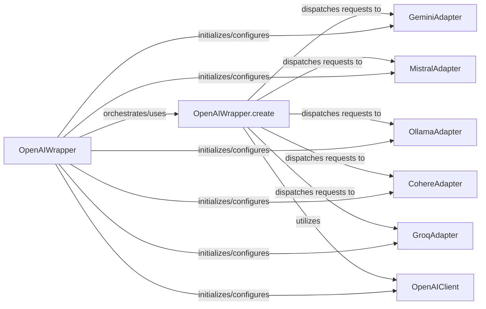

## Details

The `LLM Integration Layer` subsystem is primarily defined by the `autogen.oai.client` module and its related provider-specific adapter modules (e.g., `autogen.oai.gemini`, `autogen.oai.mistral`, etc.). This layer acts as a crucial abstraction, enabling the `autogen` framework to interact with diverse Large Language Models (LLMs) from various providers through a unified interface.

### OpenAIWrapper
Serves as the central facade for all LLM interactions within the `autogen` framework. It provides a high-level, consistent interface for agents to communicate with diverse LLMs, abstracting provider-specific details and managing the lifecycle of various LLM clients.

**Related Classes/Methods**:

- <a href="https://github.com/ag2ai/ag2/blob/main/autogen/oai/client.py#L721-L1457" target="_blank" rel="noopener noreferrer">`autogen.oai.client.OpenAIWrapper`:721-1457</a>

### OpenAIWrapper.create
Orchestrates the end-to-end flow of a single LLM request. This includes preparing request parameters, selecting the appropriate LLM provider adapter, delegating the call, and handling the response. This centralizes the routing logic for LLM calls.

**Related Classes/Methods**:

- <a href="https://github.com/ag2ai/ag2/blob/main/autogen/oai/client.py" target="_blank" rel="noopener noreferrer">`autogen.oai.client.OpenAIWrapper:create`</a>

### OpenAIClient
Provides foundational capabilities for interacting directly with OpenAI-compatible LLM APIs. It serves as a base class or concrete implementation for specific OpenAI and Azure OpenAI integrations, handling low-level API calls and data formatting.

**Related Classes/Methods**:

- <a href="https://github.com/ag2ai/ag2/blob/main/autogen/oai/client.py#L339-L718" target="_blank" rel="noopener noreferrer">`autogen.oai.client.OpenAIClient`:339-718</a>

### GeminiAdapter
A specialized adapter for Google Gemini models. It translates generic LLM requests into Gemini-specific API calls, handles communication with the Gemini API, and parses responses back into a format consumable by `OpenAIWrapper`.

**Related Classes/Methods**:

- <a href="https://github.com/ag2ai/ag2/blob/main/autogen/oai/gemini.py" target="_blank" rel="noopener noreferrer">`autogen.oai.gemini.GeminiAdapter`</a>

### MistralAdapter
Similar to `GeminiAdapter`, but specifically tailored for interacting with Mistral models and their unique API.

**Related Classes/Methods**:

- <a href="https://github.com/ag2ai/ag2/blob/main/autogen/oai/mistral.py" target="_blank" rel="noopener noreferrer">`autogen.oai.mistral.MistralAdapter`</a>

### OllamaAdapter
Facilitates interactions with Ollama models, often used for local or self-hosted LLM deployments. It handles the specific API calls and data formats for Ollama.

**Related Classes/Methods**:

- <a href="https://github.com/ag2ai/ag2/blob/main/autogen/oai/ollama.py" target="_blank" rel="noopener noreferrer">`autogen.oai.ollama.OllamaAdapter`</a>

### CohereAdapter
Provides the necessary logic to interact with Cohere models, translating requests and parsing responses according to Cohere's API.

**Related Classes/Methods**:

- <a href="https://github.com/ag2ai/ag2/blob/main/autogen/oai/cohere.py" target="_blank" rel="noopener noreferrer">`autogen.oai.cohere.CohereAdapter`</a>

### GroqAdapter
Specialized for Groq models, focusing on optimizing interactions for high-performance inference.

**Related Classes/Methods**:

- <a href="https://github.com/ag2ai/ag2/blob/main/autogen/oai/groq.py" target="_blank" rel="noopener noreferrer">`autogen.oai.groq.GroqAdapter`</a>

### [FAQ](https://github.com/CodeBoarding/GeneratedOnBoardings/tree/main?tab=readme-ov-file#faq)