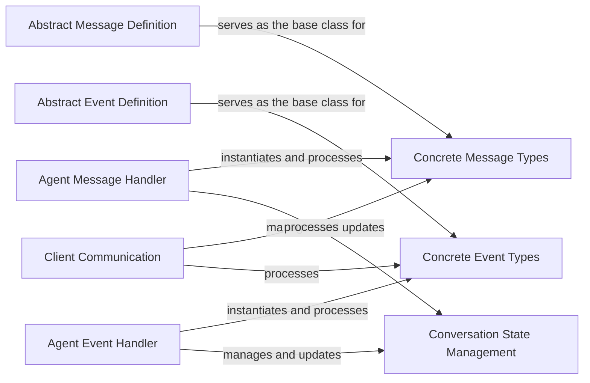

## Details

The `autogen` messaging and event subsystem is built upon a clear separation of concerns, starting with `Abstract Message Definition` and `Abstract Event Definition` as foundational contracts for all communication. `Concrete Message Types` and `Concrete Event Types` provide the specific data structures for various interaction scenarios, such as text, function calls, and tool usage. The `Agent Message Handler` and `Agent Event Handler` act as central orchestrators, processing these concrete messages and events, and critically, interacting with the `Conversation State Management` component (primarily the `Agent` class) to maintain conversational context. Finally, the `Client Communication` component handles all external interactions, ensuring proper formatting and processing of data exchanged with clients. This architecture facilitates a modular and extensible system for agent-based communication.

### Abstract Message Definition
The foundational abstract class (`autogen.messages.base_message.BaseMessage`) that establishes common attributes and behaviors for all message types within the system. It defines the contract for what constitutes a message.

**Related Classes/Methods**:

- <a href="https://github.com/ag2ai/ag2/blob/main/autogen/messages/base_message.py#L20-L40" target="_blank" rel="noopener noreferrer">`autogen.messages.base_message.BaseMessage`:20-40</a>

### Abstract Event Definition
The foundational abstract class (`autogen.events.base_event.BaseEvent`) that mirrors the purpose of `BaseMessage` but for events, establishing common attributes and behaviors for all event types.

**Related Classes/Methods**:

- <a href="https://github.com/ag2ai/ag2/blob/main/autogen/events/base_event.py#L18-L32" target="_blank" rel="noopener noreferrer">`autogen.events.base_event.BaseEvent`:18-32</a>

### Agent Message Handler
The core component (`autogen.messages.agent_messages`) responsible for managing inter-agent message handling, including validation, encoding, and the crucial management of conversational context. It orchestrates the flow of messages between agents.

**Related Classes/Methods**:

- <a href="https://github.com/ag2ai/ag2/blob/main/autogen/messages/agent_messages.py" target="_blank" rel="noopener noreferrer">`autogen.messages.agent_messages`</a>

### Agent Event Handler
The core component (`autogen.events.agent_events`) for handling events generated by agents, analogous to `Agent Message Handler` but specifically for event processing and context management.

**Related Classes/Methods**:

- <a href="https://github.com/ag2ai/ag2/blob/main/autogen/events/agent_events.py" target="_blank" rel="noopener noreferrer">`autogen.events.agent_events`</a>

### Concrete Message Types
Represents the various concrete implementations of message types that inherit from `Abstract Message Definition`. These are the actual data structures carrying specific information (e.g., tool calls, function calls, text messages). Key examples include `TextMessage`, `FunctionCallMessage`, and `ToolCallMessage`.

**Related Classes/Methods**:

- <a href="https://github.com/ag2ai/ag2/blob/main/autogen/messages/agent_messages.py#L232-L267" target="_blank" rel="noopener noreferrer">`autogen.messages.agent_messages.TextMessage`:232-267</a>
- <a href="https://github.com/ag2ai/ag2/blob/main/autogen/messages/agent_messages.py#L167-L182" target="_blank" rel="noopener noreferrer">`autogen.messages.agent_messages.FunctionCallMessage`:167-182</a>
- <a href="https://github.com/ag2ai/ag2/blob/main/autogen/messages/agent_messages.py#L209-L229" target="_blank" rel="noopener noreferrer">`autogen.messages.agent_messages.ToolCallMessage`:209-229</a>

### Concrete Event Types
Represents the various concrete implementations of event types that inherit from `Abstract Event Definition`. These are the actual data structures for specific events (e.g., function calls, tool responses, text events). Key examples include `TextEvent`, `FunctionCallEvent`, and `ToolCallEvent`.

**Related Classes/Methods**:

- <a href="https://github.com/ag2ai/ag2/blob/main/autogen/events/agent_events.py#L201-L235" target="_blank" rel="noopener noreferrer">`autogen.events.agent_events.TextEvent`:201-235</a>
- <a href="https://github.com/ag2ai/ag2/blob/main/autogen/events/agent_events.py#L138-L152" target="_blank" rel="noopener noreferrer">`autogen.events.agent_events.FunctionCallEvent`:138-152</a>
- <a href="https://github.com/ag2ai/ag2/blob/main/autogen/events/agent_events.py#L179-L198" target="_blank" rel="noopener noreferrer">`autogen.events.agent_events.ToolCallEvent`:179-198</a>

### Conversation State Management
This component is primarily embodied within the `Agent` class, responsible for storing and managing the conversational context and history for individual agents. It enables the 'carryover' of information across interactions, crucial for coherent multi-turn conversations.

**Related Classes/Methods**:

- <a href="https://github.com/ag2ai/ag2/blob/main/autogen/agentchat/agent.py" target="_blank" rel="noopener noreferrer">`autogen.agentchat.agent.Agent`</a>

### Client Communication
This component (combining `autogen.messages.client_messages` and `autogen.events.client_events`) manages messages and events originating from or directed to external clients. It handles the formatting and processing of client-facing communication, including usage summaries.

**Related Classes/Methods**:

- <a href="https://github.com/ag2ai/ag2/blob/main/autogen/messages/client_messages.py" target="_blank" rel="noopener noreferrer">`autogen.messages.client_messages`</a>
- <a href="https://github.com/ag2ai/ag2/blob/main/autogen/events/client_events.py" target="_blank" rel="noopener noreferrer">`autogen.events.client_events`</a>

### [FAQ](https://github.com/CodeBoarding/GeneratedOnBoardings/tree/main?tab=readme-ov-file#faq)