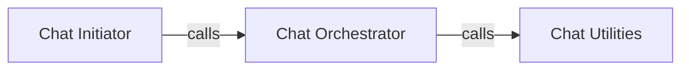

## Details

The `Orchestration & Conversation Management` subsystem is central to coordinating complex multi-agent conversations within the project. Its boundaries are primarily defined by the `autogen.agentchat.chat` module, which encapsulates the core logic for managing chat flows and task execution among agents.

### Chat Orchestrator
This is the core component responsible for managing the entire lifecycle and flow of multi-agent conversations. It handles the initiation of synchronous and asynchronous chats, post-processing of messages, validation of recipients, and managing dependencies for complex chat sequences. It directly embodies the "Orchestration/Coordination" architectural pattern.

**Related Classes/Methods**:

- <a href="https://github.com/ag2ai/ag2/blob/main/autogen/agentchat/chat.py" target="_blank" rel="noopener noreferrer">`autogen.agentchat.chat`</a>
- <a href="https://github.com/ag2ai/ag2/blob/main/autogen/agentchat/chat.py#L139-L199" target="_blank" rel="noopener noreferrer">`autogen.agentchat.chat.initiate_chats`:139-199</a>
- <a href="https://github.com/ag2ai/ag2/blob/main/autogen/agentchat/chat.py#L251-L309" target="_blank" rel="noopener noreferrer">`autogen.agentchat.chat.a_initiate_chats`:251-309</a>
- <a href="https://github.com/ag2ai/ag2/blob/main/autogen/agentchat/chat.py#L127-L136" target="_blank" rel="noopener noreferrer">`autogen.agentchat.chat.__post_carryover_processing`:127-136</a>
- <a href="https://github.com/ag2ai/ag2/blob/main/autogen/agentchat/chat.py#L50-L60" target="_blank" rel="noopener noreferrer">`autogen.agentchat.chat._validate_recipients`:50-60</a>
- <a href="https://github.com/ag2ai/ag2/blob/main/autogen/agentchat/chat.py#L78-L115" target="_blank" rel="noopener noreferrer">`autogen.agentchat.chat.__find_async_chat_order`:78-115</a>
- <a href="https://github.com/ag2ai/ag2/blob/main/autogen/agentchat/chat.py#L63-L75" target="_blank" rel="noopener noreferrer">`autogen.agentchat.chat.__create_async_prerequisites`:63-75</a>
- <a href="https://github.com/ag2ai/ag2/blob/main/autogen/agentchat/chat.py#L214-L248" target="_blank" rel="noopener noreferrer">`autogen.agentchat.chat._dependent_chat_future`:214-248</a>

### Chat Initiator
This component serves as the primary interface for individual agents to start new conversations. It abstracts the underlying complexity of conversation setup, delegating the actual orchestration to the `Chat Orchestrator`. This aligns with the "Agent Roles and Responsibilities" pattern, providing a clear mechanism for agents to engage in collaborative discussions.

**Related Classes/Methods**:

- <a href="https://github.com/ag2ai/ag2/blob/main/autogen/agentchat/conversable_agent.py" target="_blank" rel="noopener noreferrer">`autogen.agentchat.conversable_agent`</a>

### Chat Utilities
This component provides essential helper functions that support the `Chat Orchestrator` by consolidating and preparing chat-related data. It acts as a supporting module, ensuring efficient and organized management of conversation-related information.

**Related Classes/Methods**:

- <a href="https://github.com/ag2ai/ag2/blob/main/autogen/agentchat/utils.py" target="_blank" rel="noopener noreferrer">`autogen.agentchat.utils`</a>
- <a href="https://github.com/ag2ai/ag2/blob/main/autogen/agentchat/utils.py#L14-L33" target="_blank" rel="noopener noreferrer">`autogen.agentchat.utils.consolidate_chat_info`:14-33</a>

### [FAQ](https://github.com/CodeBoarding/GeneratedOnBoardings/tree/main?tab=readme-ov-file#faq)