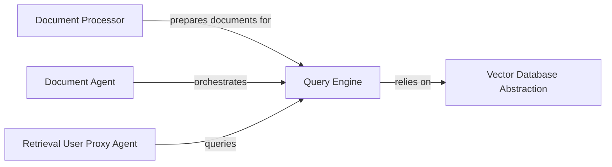

## Details

The Retrieval Augmented Generation (RAG) System subsystem encompasses the functionalities required for ingesting, storing, and querying external documents or knowledge bases to enhance LLM responses. Its boundaries are defined by the components responsible for document processing, vector storage abstraction, query execution, and the agents that orchestrate and utilize these retrieval capabilities.

### Document Processor
This component is responsible for the fundamental operations of document ingestion. It fetches files from various sources (directories, URLs), extracts text from diverse formats (e.g., PDF, HTML), and intelligently splits documents into manageable chunks suitable for indexing. Its primary role is to prepare raw data for subsequent processing and storage.

**Related Classes/Methods**:

- <a href="https://github.com/ag2ai/ag2/blob/main/autogen/retrieve_utils.py" target="_blank" rel="noopener noreferrer">`autogen.retrieve_utils`</a>

### Vector Database Abstraction
Provides a standardized, technology-agnostic interface for interacting with various vector database solutions (e.g., ChromaDB, Qdrant, MongoDB). It abstracts away the complexities of specific database implementations, offering methods for creating/deleting collections, and performing CRUD (Create, Retrieve, Update, Delete) operations on documents within the vector store.

**Related Classes/Methods**:

- <a href="https://github.com/ag2ai/ag2/blob/main/autogen/agentchat/contrib/vectordb" target="_blank" rel="noopener noreferrer">`autogen.agentchat.contrib.vectordb`</a>

### Query Engine
Acts as the core search and retrieval mechanism. It consumes processed document chunks for indexing into the vector database and performs similarity searches based on incoming queries. Specific implementations exist for different vector database backends (e.g., `chroma_query_engine`, `llamaindex_query_engine`).

**Related Classes/Methods**:

- <a href="https://github.com/ag2ai/ag2/blob/main/autogen/agentchat/contrib/rag" target="_blank" rel="noopener noreferrer">`autogen.agentchat.contrib.rag`</a>

### Document Agent
A specialized agent that orchestrates the end-to-end document-related tasks within the multi-agent system. It manages the workflow of ingesting documents into the vector database and responding to queries by leveraging the underlying retrieval capabilities provided by the Query Engine.

**Related Classes/Methods**:

- <a href="https://github.com/ag2ai/ag2/blob/main/autogen/agents/experimental/document_agent/document_agent.py" target="_blank" rel="noopener noreferrer">`autogen.agents.experimental.document_agent.document_agent`</a>

### Retrieval User Proxy Agent
A specialized user proxy agent designed to automatically retrieve relevant documents to augment LLM responses. It intelligently manages the context for retrieval, integrating retrieved information seamlessly into ongoing agent conversations to provide more informed and accurate responses.

**Related Classes/Methods**:

- <a href="https://github.com/ag2ai/ag2/blob/main/autogen/agentchat/contrib/retrieve_user_proxy_agent.py" target="_blank" rel="noopener noreferrer">`autogen.agentchat.contrib.retrieve_user_proxy_agent`</a>

### [FAQ](https://github.com/CodeBoarding/GeneratedOnBoardings/tree/main?tab=readme-ov-file#faq)