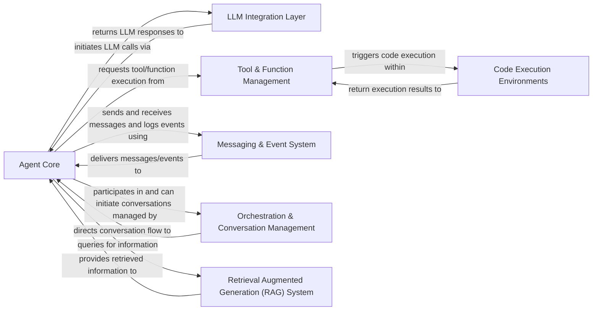

## Details

The `autogen` project is structured around a central `Agent Core` that orchestrates interactions with various specialized components. The `LLM Integration Layer` provides the interface for external language models, while `Tool & Function Management` enables agents to utilize external capabilities, often involving `Code Execution Environments`. Communication within the system is facilitated by the `Messaging & Event System`. Complex multi-agent scenarios are managed by the `Orchestration & Conversation Management` component. Finally, the `Retrieval Augmented Generation (RAG) System` augments agent knowledge with external data. Human interaction and basic guardrail functionalities are integrated directly within the `Agent Core` to streamline agent-human collaboration and ensure controlled message flow.

### Agent Core [[Expand]](./Agent_Core.md)
The central intelligence and control unit for all agents, managing their behaviors, message processing, decision-making logic, and direct human interaction, including basic message validation and guardrail functionalities.

**Related Classes/Methods**:

- <a href="https://github.com/ag2ai/ag2/blob/main/autogen/agentchat/conversable_agent.py#L127-L4055" target="_blank" rel="noopener noreferrer">`autogen.agentchat.conversable_agent.ConversableAgent`:127-4055</a>

### LLM Integration Layer [[Expand]](./LLM_Integration_Layer.md)
Provides a unified interface for interacting with various Large Language Models (LLMs) from different providers, abstracting their specific APIs.

**Related Classes/Methods**:

- <a href="https://github.com/ag2ai/ag2/blob/main/autogen/oai/client.py#L721-L1457" target="_blank" rel="noopener noreferrer">`autogen.oai.client.OpenAIWrapper`:721-1457</a>

### Tool & Function Management
Manages the lifecycle of external tools and functions, enabling agents to discover, register, and execute them to perform specific actions.

**Related Classes/Methods**:

- <a href="https://github.com/ag2ai/ag2/blob/main/autogen/tools/tool.py#L172-L187" target="_blank" rel="noopener noreferrer">`autogen.tools.tool.Tool`:172-187</a>

### Code Execution Environments [[Expand]](./Code_Execution_Environments.md)
Offers secure and isolated environments (e.g., local, Docker) for agents to execute code, supporting various programming languages.

**Related Classes/Methods**:

- <a href="https://github.com/ag2ai/ag2/blob/main/autogen/coding/local_commandline_code_executor.py" target="_blank" rel="noopener noreferrer">`autogen.coding.local_commandline_code_executor`</a>

### Messaging & Event System [[Expand]](./Messaging_Event_System.md)
The foundational communication backbone, responsible for routing messages, handling events, and ensuring reliable data flow across the agent system.

**Related Classes/Methods**:

- <a href="https://github.com/ag2ai/ag2/blob/main/autogen/messages/base_message.py" target="_blank" rel="noopener noreferrer">`autogen.messages.base_message`</a>

### Orchestration & Conversation Management [[Expand]](./Orchestration_Conversation_Management.md)
Coordinates complex multi-agent conversations, manages chat flows, and handles the sequential or parallel execution of tasks among agents.

**Related Classes/Methods**:

- <a href="https://github.com/ag2ai/ag2/blob/main/autogen/agentchat/chat.py" target="_blank" rel="noopener noreferrer">`autogen.agentchat.chat`</a>

### Retrieval Augmented Generation (RAG) System [[Expand]](./Retrieval_Augmented_Generation_RAG_System.md)
Provides capabilities for ingesting, storing, and querying external documents or knowledge bases to augment LLM responses with relevant, up-to-date information.

**Related Classes/Methods**:

- <a href="https://github.com/ag2ai/ag2/blob/main/autogen/retrieve_utils.py" target="_blank" rel="noopener noreferrer">`autogen.retrieve_utils`</a>

### [FAQ](https://github.com/CodeBoarding/GeneratedOnBoardings/tree/main?tab=readme-ov-file#faq)