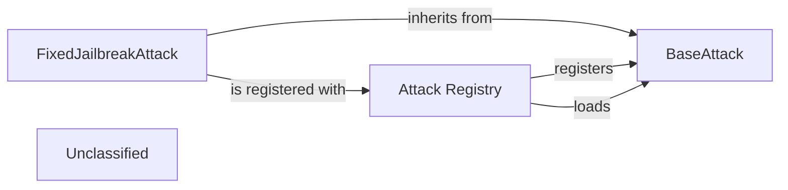

## Details

The `attacks` subsystem in `agentdojo` is designed around a flexible and extensible architecture for defining and managing various attack strategies. The core of this subsystem is the `BaseAttack` abstract class, which establishes a common interface for all attack implementations, promoting a Strategy pattern. Concrete attack types, such as `FixedJailbreakAttack`, extend `BaseAttack` to provide specific attack logic. A central `Attack Registry` component facilitates the dynamic registration and loading of these attack types, enabling the system to discover and utilize different attack strategies at runtime. This design ensures that new attack methods can be easily integrated and managed, enhancing the adaptability and configurability of the benchmarking framework.

### BaseAttack
This abstract base class defines the common interface and core functionalities for all attack types. It serves as the strategic blueprint for how an attack should be structured and executed, providing methods for generating and applying injections. This component is crucial for the Strategy/Plugin pattern, enabling diverse attack implementations.

**Related Classes/Methods**:

- <a href="https://github.com/ethz-spylab/agentdojo/blob/mainsrc/agentdojo/attacks/base_attacks.py#L25-L96" target="_blank" rel="noopener noreferrer">`agentdojo.attacks.base_attacks.BaseAttack`:25-96</a>

### FixedJailbreakAttack
A concrete implementation of the BaseAttack interface, specifically designed for jailbreak attacks using a fixed template. It demonstrates how specific attack strategies are realized by extending the BaseAttack class and implementing its abstract methods.

**Related Classes/Methods**:

- <a href="https://github.com/ethz-spylab/agentdojo/blob/mainsrc/agentdojo/attacks/base_attacks.py#L99-L125" target="_blank" rel="noopener noreferrer">`agentdojo.attacks.base_attacks.FixedJailbreakAttack`:99-125</a>

### Attack Registry
This component provides a centralized mechanism for registering, storing, and loading different attack types. It acts as a lookup service, allowing the system to dynamically discover and instantiate attack classes based on their registered names. This is vital for the configurability and extensibility of the benchmarking framework.

**Related Classes/Methods**:

- <a href="https://github.com/ethz-spylab/agentdojo/blob/mainsrc/agentdojo/attacks/attack_registry.py#L13-L37" target="_blank" rel="noopener noreferrer">`agentdojo.attacks.attack_registry.register_attack`:13-37</a>
- <a href="https://github.com/ethz-spylab/agentdojo/blob/mainsrc/agentdojo/attacks/attack_registry.py#L40-L50" target="_blank" rel="noopener noreferrer">`agentdojo.attacks.attack_registry.load_attack`:40-50</a>

### Unclassified
Component for all unclassified files and utility functions (Utility functions/External Libraries/Dependencies)

**Related Classes/Methods**: _None_

### [FAQ](https://github.com/CodeBoarding/GeneratedOnBoardings/tree/main?tab=readme-ov-file#faq)