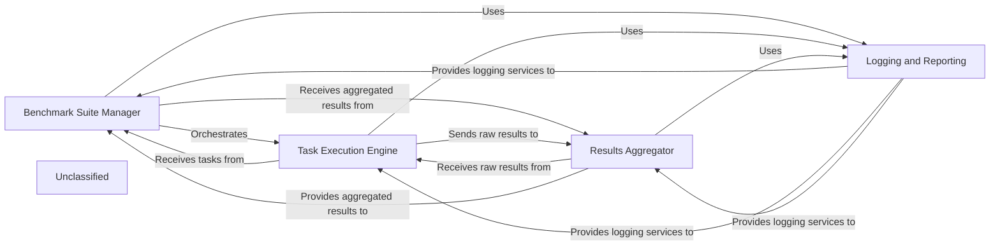

## Details

The AgentDojo benchmarking subsystem is designed to systematically evaluate agent pipelines against various task suites, including those with adversarial injections. The Benchmark Suite Manager initiates and oversees the entire benchmarking process, loading task suites and coordinating the execution of individual tasks. The Task Execution Engine is responsible for running these tasks, handling the application of injections, and interacting with the agent pipelines. As tasks complete, the Results Aggregator collects and consolidates the raw outcomes into comprehensive suite results. Throughout this process, the Logging and Reporting component provides essential services for capturing detailed execution traces and benchmark metrics, ensuring transparency and facilitating post-run analysis.

### Benchmark Suite Manager
This component is responsible for loading and managing benchmark suites. It initiates the overall benchmarking process, coordinating the execution of tasks defined within a suite.

**Related Classes/Methods**:

- <a href="https://github.com/ethz-spylab/agentdojo/blob/mainsrc/agentdojo/benchmark.py#L160-L229" target="_blank" rel="noopener noreferrer">`benchmark_suite_with_injections`:160-229</a>

### Task Execution Engine
This component handles the execution of individual tasks within a benchmark suite. It manages the application of injections (attacks) when required and interacts with the underlying LLM agents to perform the task.

**Related Classes/Methods**:

- <a href="https://github.com/ethz-spylab/agentdojo/blob/mainsrc/agentdojo/benchmark.py#L41-L157" target="_blank" rel="noopener noreferrer">`run_task_with_injection_tasks`:41-157</a>
- <a href="https://github.com/ethz-spylab/agentdojo/blob/mainsrc/agentdojo/benchmark.py#L232-L316" target="_blank" rel="noopener noreferrer">`run_task_without_injection_tasks`:232-316</a>

### Results Aggregator
This component collects raw results from executed tasks, processes them, and aggregates them into a final, comprehensive suite result. It is responsible for data consolidation and preparing outcomes for reporting.

**Related Classes/Methods**:

- <a href="https://github.com/ethz-spylab/agentdojo/blob/mainsrc/agentdojo/benchmark.py#L23-L33" target="_blank" rel="noopener noreferrer">`SuiteResults`:23-33</a>
- <a href="https://github.com/ethz-spylab/agentdojo/blob/mainsrc/agentdojo/benchmark.py#L36-L38" target="_blank" rel="noopener noreferrer">`aggregate_results`:36-38</a>

### Logging and Reporting
This component manages detailed logging of benchmark runs, capturing events, task outcomes, and other relevant data. It provides the necessary infrastructure for generating reports based on the collected logs.

**Related Classes/Methods**:

- <a href="https://github.com/ethz-spylab/agentdojo/blob/mainsrc/agentdojo/logging.py#L153-L278" target="_blank" rel="noopener noreferrer">`TraceLogger`:153-278</a>

### Unclassified
Component for all unclassified files and utility functions (Utility functions/External Libraries/Dependencies)

**Related Classes/Methods**: _None_

### [FAQ](https://github.com/CodeBoarding/GeneratedOnBoardings/tree/main?tab=readme-ov-file#faq)