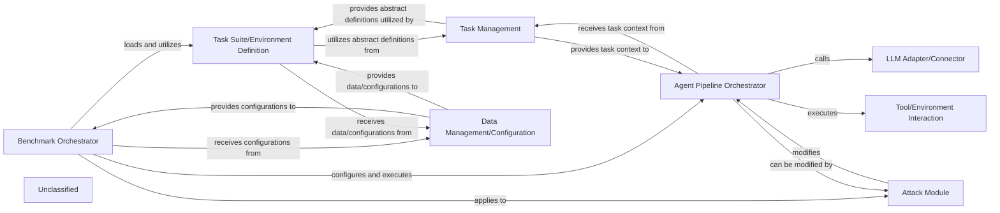

## Details

The AgentDojo project is designed to benchmark the robustness and security of AI agents against various adversarial attacks. At its core, the Benchmark Orchestrator (agentdojo.benchmark) initiates and manages the entire benchmarking process. It loads predefined Task Suite/Environment Definitions (agentdojo.task_suite.task_suite.TaskSuite from src/agentdojo/default_suites), which provide concrete task scenarios and simulated environments. The orchestrator then configures and executes the Agent Pipeline Orchestrator (agentdojo.agent_pipeline.agent_pipeline.AgentPipeline), which is responsible for the agent's sequential execution flow, including interactions with LLM Adapter/Connector (agentdojo.agent_pipeline.agent_pipeline.get_llm from src/agentdojo/agent_pipeline/llms) and Tool/Environment Interaction (agentdojo.functions_runtime.FunctionsRuntime from src/agentdojo/default_suites/v1/tools). Adversarial scenarios are introduced by the Attack Module (agentdojo.attacks.base_attacks.BaseAttack), which applies various attacks to the agent or its environment. The system relies on Task Management (agentdojo.base_tasks.BaseUserTask from src/agentdojo/base_tasks.py) for abstract task definitions and Data Management/Configuration (agentdojo.data from src/agentdojo/data) for loading and storing benchmark configurations and static data.

### Benchmark Orchestrator [[Expand]](./Benchmark_Orchestrator.md)
Initiates and manages the overall benchmarking process. It loads task suites, configures the agent pipeline, applies attacks, and triggers the execution and evaluation of agents. This component acts as the central control flow for the entire benchmarking run.

**Related Classes/Methods**:

- <a href="https://github.com/ethz-spylab/agentdojo/blob/mainsrc/agentdojo/benchmark.py" target="_blank" rel="noopener noreferrer">`agentdojo.benchmark`</a>

### Agent Pipeline Orchestrator
Manages the sequential execution flow of an agent, encompassing LLM interactions, planning, tool execution, and potentially PII detection. It acts as a configurable pipeline for agent behavior, allowing for the insertion of various modules (e.g., LLM, tools, defenses).

**Related Classes/Methods**:

- <a href="https://github.com/ethz-spylab/agentdojo/blob/mainsrc/agentdojo/agent_pipeline/agent_pipeline.py#L158-L265" target="_blank" rel="noopener noreferrer">`agentdojo.agent_pipeline.agent_pipeline.AgentPipeline`:158-265</a>

### LLM Adapter/Connector
Provides a standardized interface for interacting with various Large Language Models (LLMs) from different providers (e.g., Anthropic, Google, OpenAI). It abstracts away provider-specific API details, enabling interchangeable LLM backends.

**Related Classes/Methods**:

- <a href="https://github.com/ethz-spylab/agentdojo/blob/mainsrc/agentdojo/agent_pipeline/agent_pipeline.py#L70-L125" target="_blank" rel="noopener noreferrer">`agentdojo.agent_pipeline.agent_pipeline.get_llm`:70-125</a>

### Attack Module
Defines, registers, and applies various adversarial attacks (e.g., baseline, DoS, important instructions) to the agent or its environment to test robustness and security. It injects malicious inputs or modifies agent behavior.

**Related Classes/Methods**:

- <a href="https://github.com/ethz-spylab/agentdojo/blob/mainsrc/agentdojo/attacks/base_attacks.py#L25-L96" target="_blank" rel="noopener noreferrer">`agentdojo.attacks.base_attacks.BaseAttack`:25-96</a>

### Task Management
Defines the fundamental abstract structure and lifecycle of tasks within the benchmark, including base tasks, user tasks, injection tasks, task configurations, environments, and expected outputs. It provides the blueprint for specific task instances.

**Related Classes/Methods**:

- <a href="https://github.com/ethz-spylab/agentdojo/blob/mainsrc/agentdojo/base_tasks.py#L18-L94" target="_blank" rel="noopener noreferrer">`agentdojo.base_tasks.BaseUserTask`:18-94</a>

### Task Suite/Environment Definition
Provides concrete, predefined sets of benchmark tasks, injection scenarios, and simulated external tools, organized by domain and version. These suites instantiate abstract task definitions and offer ready-to-use assets and configurations for various domains, facilitating quick setup and standardized testing.

**Related Classes/Methods**:

- <a href="https://github.com/ethz-spylab/agentdojo/blob/mainsrc/agentdojo/task_suite/task_suite.py#L104-L479" target="_blank" rel="noopener noreferrer">`agentdojo.task_suite.task_suite.TaskSuite`:104-479</a>

### Tool/Environment Interaction
Simulates external services and tools (e.g., banking client, calendar client, email client) that the agent can interact with during task execution. It provides the operational environment and external capabilities for the agent, allowing for realistic interaction testing.

**Related Classes/Methods**:

- <a href="https://github.com/ethz-spylab/agentdojo/blob/mainsrc/agentdojo/functions_runtime.py#L178-L312" target="_blank" rel="noopener noreferrer">`agentdojo.functions_runtime.FunctionsRuntime`:178-312</a>

### Data Management/Configuration
Manages the loading and storage of configuration files (e.g., `environment.yaml`, `injection_vectors.yaml`, `system_messages.yaml`) that define benchmark setups, attack parameters, system prompts, and other static data.

**Related Classes/Methods**:

- <a href="https://github.com/ethz-spylab/agentdojo/blob/mainsrc/agentdojo/data" target="_blank" rel="noopener noreferrer">`agentdojo.data`</a>

### Unclassified
Component for all unclassified files and utility functions (Utility functions/External Libraries/Dependencies)

**Related Classes/Methods**: _None_

### [FAQ](https://github.com/CodeBoarding/GeneratedOnBoardings/tree/main?tab=readme-ov-file#faq)