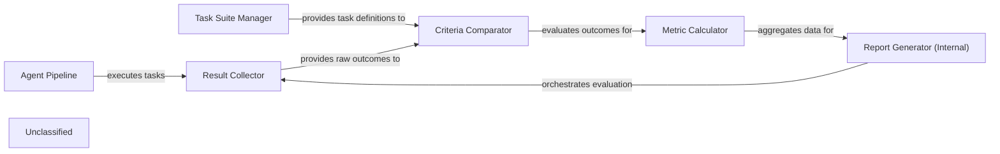

## Details

The agentdojo.benchmark subsystem evaluates agent performance by orchestrating task execution through the Agent Pipeline, utilizing the Task Suite Manager for task definitions and evaluation criteria. The Result Collector gathers raw outputs, which the Criteria Comparator then evaluates against benchmarks. The Metric Calculator computes performance metrics, and the Report Generator (Internal) compiles a comprehensive report for an external Benchmark Orchestrator. This ensures a structured assessment of agent utility and security.

### Agent Pipeline
Represents the configurable sequence of operations an agent performs to complete a task, producing outputs that are then evaluated.

**Related Classes/Methods**:

- <a href="https://github.com/ethz-spylab/agentdojo/blob/mainsrc/agentdojo/agent_pipeline/base_pipeline_element.py#L8-L37" target="_blank" rel="noopener noreferrer">`agentdojo.agent_pipeline.base_pipeline_element.BasePipelineElement`:8-37</a>

### Task Suite Manager
Manages and provides definitions for user tasks and injection tasks, including their expected outcomes, ground truth, and criteria for evaluation.

**Related Classes/Methods**:

- <a href="https://github.com/ethz-spylab/agentdojo/blob/mainsrc/agentdojo/task_suite/task_suite.py#L104-L479" target="_blank" rel="noopener noreferrer">`agentdojo.task_suite.task_suite.TaskSuite`:104-479</a>

### Result Collector
Gathers raw outputs and states from the Agent Pipeline after task execution, specifically focusing on utility and security outcomes for each task, and stores them in structured dictionaries.

**Related Classes/Methods**:

- <a href="https://github.com/ethz-spylab/agentdojo/blob/mainsrc/agentdojo/benchmark.py#L41-L157" target="_blank" rel="noopener noreferrer">`agentdojo.benchmark.run_task_with_injection_tasks`:41-157</a>
- <a href="https://github.com/ethz-spylab/agentdojo/blob/mainsrc/agentdojo/benchmark.py#L23-L33" target="_blank" rel="noopener noreferrer">`agentdojo.benchmark.SuiteResults`:23-33</a>

### Criteria Comparator
Compares agent outputs against predefined task criteria, ground truth, and expected outcomes by invoking the task suite's evaluation logic to determine task utility and security.

**Related Classes/Methods**:

- <a href="https://github.com/ethz-spylab/agentdojo/blob/mainsrc/agentdojo/benchmark.py#L41-L157" target="_blank" rel="noopener noreferrer">`agentdojo.benchmark.run_task_with_injection_tasks`:41-157</a>

### Metric Calculator
Aggregates individual task results to compute overall performance metrics, such as average utility or security scores.

**Related Classes/Methods**:

- <a href="https://github.com/ethz-spylab/agentdojo/blob/mainsrc/agentdojo/benchmark.py#L36-L38" target="_blank" rel="noopener noreferrer">`agentdojo.benchmark.aggregate_results`:36-38</a>

### Report Generator (Internal)
Orchestrates the entire benchmarking process for a suite of tasks, collects all individual and aggregated results, and structures them into a comprehensive SuiteResults object for final reporting.

**Related Classes/Methods**:

- <a href="https://github.com/ethz-spylab/agentdojo/blob/mainsrc/agentdojo/benchmark.py#L160-L229" target="_blank" rel="noopener noreferrer">`agentdojo.benchmark.benchmark_suite_with_injections`:160-229</a>

### Unclassified
Component for all unclassified files and utility functions (Utility functions/External Libraries/Dependencies)

**Related Classes/Methods**: _None_

### [FAQ](https://github.com/CodeBoarding/GeneratedOnBoardings/tree/main?tab=readme-ov-file#faq)