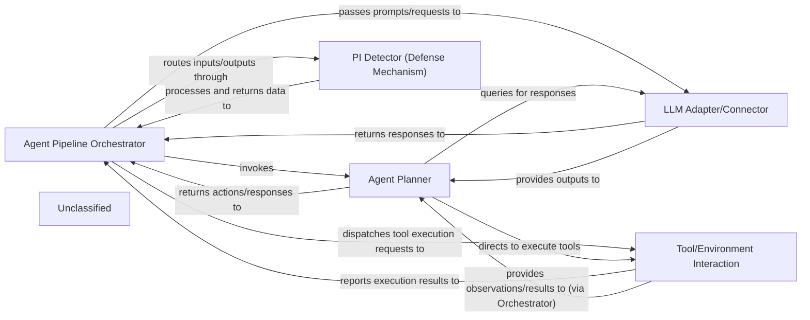

## Details

The `agentdojo.agent_pipeline` subsystem forms the core of the LLM agent's operational logic. The `Agent Pipeline Orchestrator` (`AgentPipeline`) serves as the central control, managing the overall flow from initial query to final response. It delegates planning responsibilities to the `Agent Planner` (`Planner`), which determines the necessary actions, including the use of external tools or direct LLM interaction. The `LLM Adapter/Connector` (represented by `PromptingLLM`) provides a unified interface for communicating with various LLMs, abstracting away model-specific details. For security and privacy, the `PI Detector (Defense Mechanism)` (`PIDetector`) is integrated into the pipeline to scrutinize data for sensitive information. When external actions are required, the `Tool/Environment Interaction` (`ToolExecution`) component handles the execution of tools and reports the outcomes back to the orchestrator, which then informs the planner. This structured interaction ensures a robust and adaptable agent behavior, with clear separation of concerns for orchestration, planning, LLM communication, defense, and external tool handling.

### Agent Pipeline Orchestrator
The central execution engine of the LLM agent. It orchestrates the sequential flow of operations, managing inputs, coordinating planning, interacting with LLMs, executing tools, and integrating defense mechanisms. It acts as a configurable pipeline for defining and managing the agent's overall behavior.

**Related Classes/Methods**:

- <a href="https://github.com/ethz-spylab/agentdojo/blob/mainsrc/agentdojo/agent_pipeline/agent_pipeline.py#L158-L265" target="_blank" rel="noopener noreferrer">`agentdojo.agent_pipeline.agent_pipeline.AgentPipeline`:158-265</a>

### Agent Planner
Responsible for the agent's decision-making process. It interprets the current state, formulates a plan of action, and determines which tools to use or what responses to generate based on LLM outputs.

**Related Classes/Methods**:

- <a href="https://github.com/ethz-spylab/agentdojo/blob/mainsrc/agentdojo/agent_pipeline/planner.py" target="_blank" rel="noopener noreferrer">`agentdojo.agent_pipeline.planner.Planner`</a>

### LLM Adapter/Connector
Provides a standardized interface for interacting with various Large Language Models. It abstracts away the specifics of different LLM APIs, allowing the Agent Pipeline Orchestrator and Planner to communicate with diverse models seamlessly.

**Related Classes/Methods**:

- <a href="https://github.com/ethz-spylab/agentdojo/blob/mainsrc/agentdojo/agent_pipeline/llms/prompting_llm.py#L192-L326" target="_blank" rel="noopener noreferrer">`agentdojo.agent_pipeline.llms.prompting_llm.PromptingLLM`:192-326</a>

### PI Detector (Defense Mechanism)
A specialized defense module integrated into the agent's pipeline. Its primary responsibility is to detect and potentially filter Personally Identifiable Information (PII) or other sensitive data in the agent's inputs or outputs, enhancing security and privacy.

**Related Classes/Methods**:

- <a href="https://github.com/ethz-spylab/agentdojo/blob/mainsrc/agentdojo/agent_pipeline/pi_detector.py" target="_blank" rel="noopener noreferrer">`agentdojo.agent_pipeline.pi_detector.PIDetector`</a>

### Tool/Environment Interaction
Manages the execution of external tools and interactions with the environment. This component translates agent-planned actions into concrete operations within the simulated or real environment, providing feedback to the agent.

**Related Classes/Methods**:

- <a href="https://github.com/ethz-spylab/agentdojo/blob/mainsrc/agentdojo/agent_pipeline/tool_execution.py" target="_blank" rel="noopener noreferrer">`agentdojo.agent_pipeline.tool_execution.ToolExecution`</a>

### Unclassified
Component for all unclassified files and utility functions (Utility functions/External Libraries/Dependencies)

**Related Classes/Methods**: _None_

### [FAQ](https://github.com/CodeBoarding/GeneratedOnBoardings/tree/main?tab=readme-ov-file#faq)