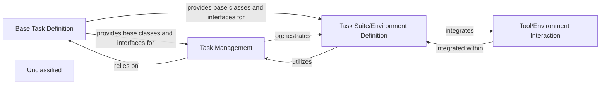

## Details

This system is designed to define, manage, and execute tasks for benchmarking agents. It establishes a foundational abstract structure for all tasks through the 'Base Task Definition' component, which provides core interfaces and properties. The 'Task Management' component orchestrates the lifecycle of these tasks, handling their loading, configuration, and execution, often relying on the base definitions. Concrete task scenarios and environments are provided by the 'Task Suite/Environment Definition' component, which organizes tasks by domain and version. These task suites integrate with the 'Tool/Environment Interaction' component, which simulates external services and tools, creating realistic and controllable environments for evaluating agent performance.

### Base Task Definition
Establishes the fundamental abstract structure and common properties for all tasks. This includes defining the interface for tasks, their inputs, expected outputs, and potentially methods for task execution or validation. It serves as the foundational blueprint for specific task types (e.g., user tasks, injection tasks). This component is crucial for ensuring consistency and extensibility across various task implementations, aligning with the "Task/Environment Definitions" pattern.

**Related Classes/Methods**:

- <a href="https://github.com/ethz-spylab/agentdojo/blob/mainsrc/agentdojo/base_tasks.py" target="_blank" rel="noopener noreferrer">`agentdojo.base_tasks`</a>

### Task Management
Manages the lifecycle of tasks, encompassing their loading, configuration, and providing access to task-specific data. It handles the instantiation of various task types (user tasks, injection tasks) based on the Base Task Definition. This component also oversees the management of task environments and their expected outputs. It acts as an orchestrator for task instances, fitting the "Benchmark Runner/Orchestrator" aspect for tasks.

**Related Classes/Methods**:

- <a href="https://github.com/ethz-spylab/agentdojo/blob/mainsrc/agentdojo/benchmark.py" target="_blank" rel="noopener noreferrer">`agentdojo.benchmark`</a>

### Task Suite/Environment Definition
Offers concrete, pre-defined collections of tasks and their corresponding environments. These suites are organized by domain (e.g., banking, travel) and version, providing ready-to-use scenarios for benchmarking. It instantiates specific tasks and environments by leveraging the abstract definitions provided by Task Management. This component embodies the "Strategy/Plugin" pattern by providing concrete task scenarios.

**Related Classes/Methods**:

- <a href="https://github.com/ethz-spylab/agentdojo/blob/mainsrc/agentdojo/default_suites" target="_blank" rel="noopener noreferrer">`agentdojo.default_suites`</a>

### Tool/Environment Interaction
Simulates external services and tools (e.g., banking client, calendar client) that an agent can interact with during task execution. These tools define the operational context and capabilities available to the agent within a specific task environment. This component is vital for creating realistic and controllable environments for LLM evaluation.

**Related Classes/Methods**:

- <a href="https://github.com/ethz-spylab/agentdojo/blob/mainsrc/agentdojo/default_suites/v1/tools" target="_blank" rel="noopener noreferrer">`agentdojo.default_suites.v1.tools`</a>

### Unclassified
Component for all unclassified files and utility functions (Utility functions/External Libraries/Dependencies)

**Related Classes/Methods**: _None_

### [FAQ](https://github.com/CodeBoarding/GeneratedOnBoardings/tree/main?tab=readme-ov-file#faq)