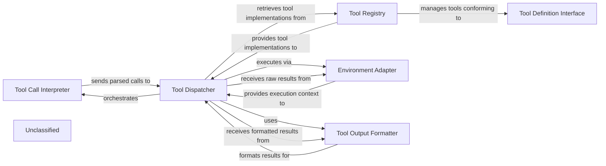

## Details

The tool execution subsystem in `agentdojo` is responsible for interpreting an agent's intent to use a tool, dispatching the tool call, executing it within a defined environment, and formatting the results for the agent. This subsystem ensures that the agent can seamlessly interact with various functionalities, whether internal or external, through a standardized mechanism.

### Tool Call Interpreter
Parses the structured output from the LLM agent (e.g., function call JSON) to accurately extract the tool name and its arguments. This component translates the agent's high-level intent into a structured, executable request.

**Related Classes/Methods**:

- <a href="https://github.com/ethz-spylab/agentdojo/blob/mainsrc/agentdojo/agent_pipeline/tool_execution.py#L46-L115" target="_blank" rel="noopener noreferrer">`agentdojo.agent_pipeline.tool_execution.ToolsExecutor`:46-115</a>

### Tool Dispatcher
The core orchestrator of tool execution within the runtime. It receives parsed tool calls, resolves the appropriate tool implementation using the Tool Registry, initiates its execution via the Environment Adapter, and manages the overall flow of a tool invocation.

**Related Classes/Methods**:

- <a href="https://github.com/ethz-spylab/agentdojo/blob/mainsrc/agentdojo/agent_pipeline/tool_execution.py#L118-L157" target="_blank" rel="noopener noreferrer">`agentdojo.agent_pipeline.tool_execution.ToolsExecutionLoop`:118-157</a>

### Tool Registry
A repository that maintains a mapping of available tool names (as understood by the LLM agent) to their actual executable implementations (functions or classes). It provides a lookup service for the Tool Dispatcher.

**Related Classes/Methods**:

- <a href="https://github.com/ethz-spylab/agentdojo/blob/mainsrc/agentdojo/functions_runtime.py#L178-L312" target="_blank" rel="noopener noreferrer">`agentdojo.functions_runtime.FunctionsRuntime`:178-312</a>

### Tool Definition Interface
Defines the standardized contract (e.g., expected input schema, output format, metadata) that all tools must adhere to. This ensures consistency and interoperability across different tool implementations.

**Related Classes/Methods**:

- <a href="https://github.com/ethz-spylab/agentdojo/blob/mainsrc/agentdojo/functions_runtime.py" target="_blank" rel="noopener noreferrer">`agentdojo.functions_runtime.Function`</a>

### Environment Adapter
An abstraction layer that allows tools to interact with the underlying environment. This can involve simulating actions within a controlled environment for benchmarking or making calls to real external APIs.

**Related Classes/Methods**:

- <a href="https://github.com/ethz-spylab/agentdojo/blob/mainsrc/agentdojo/functions_runtime.py" target="_blank" rel="noopener noreferrer">`agentdojo.functions_runtime.Env`</a>
- <a href="https://github.com/ethz-spylab/agentdojo/blob/mainsrc/agentdojo/functions_runtime.py#L12-L15" target="_blank" rel="noopener noreferrer">`agentdojo.functions_runtime.TaskEnvironment`:12-15</a>

### Tool Output Formatter
Processes the raw results returned by an executed tool and formats them into a standardized, agent-consumable representation (e.g., a concise string, JSON object) before returning to the LLM agent.

**Related Classes/Methods**:

- <a href="https://github.com/ethz-spylab/agentdojo/blob/mainsrc/agentdojo/agent_pipeline/tool_execution.py#L22-L43" target="_blank" rel="noopener noreferrer">`agentdojo.agent_pipeline.tool_execution.tool_result_to_str`:22-43</a>

### Unclassified
Component for all unclassified files and utility functions (Utility functions/External Libraries/Dependencies)

**Related Classes/Methods**: _None_

### [FAQ](https://github.com/CodeBoarding/GeneratedOnBoardings/tree/main?tab=readme-ov-file#faq)