```mermaid
graph LR
    Benchmark_Orchestrator["Benchmark Orchestrator"]
    Task_Environment_Manager["Task & Environment Manager"]
    Attack_Generation_Module["Attack Generation Module"]
    LLM_Agent_System["LLM Agent System"]
    Tool_Function_Runtime["Tool/Function Runtime"]
    Evaluation_Metrics["Evaluation & Metrics"]
    Default_Assets_Configurations["Default Assets & Configurations"]
    Unclassified["Unclassified"]
    Benchmark_Orchestrator -- "initiates task loading" --> Task_Environment_Manager
    Benchmark_Orchestrator -- "orchestrates execution" --> LLM_Agent_System
    Benchmark_Orchestrator -- "submits results" --> Evaluation_Metrics
    Task_Environment_Manager -- "provides task context" --> LLM_Agent_System
    Task_Environment_Manager -- "loads assets from" --> Default_Assets_Configurations
    Task_Environment_Manager -- "receives injections from" --> Attack_Generation_Module
    Attack_Generation_Module -- "generates injections for" --> Task_Environment_Manager
    LLM_Agent_System -- "executes tools via" --> Tool_Function_Runtime
    Tool_Function_Runtime -- "utilizes simulated tools from" --> Default_Assets_Configurations
    Evaluation_Metrics -- "processes results from" --> Benchmark_Orchestrator
    click Benchmark_Orchestrator href "https://github.com/CodeBoarding/GeneratedOnBoardings/blob/main/agentdojo/Benchmark_Orchestrator.md" "Details"
    click Task_Environment_Manager href "https://github.com/CodeBoarding/GeneratedOnBoardings/blob/main/agentdojo/Task_Environment_Manager.md" "Details"
    click Attack_Generation_Module href "https://github.com/CodeBoarding/GeneratedOnBoardings/blob/main/agentdojo/Attack_Generation_Module.md" "Details"
    click LLM_Agent_System href "https://github.com/CodeBoarding/GeneratedOnBoardings/blob/main/agentdojo/LLM_Agent_System.md" "Details"
    click Tool_Function_Runtime href "https://github.com/CodeBoarding/GeneratedOnBoardings/blob/main/agentdojo/Tool_Function_Runtime.md" "Details"
    click Evaluation_Metrics href "https://github.com/CodeBoarding/GeneratedOnBoardings/blob/main/agentdojo/Evaluation_Metrics.md" "Details"
    click Default_Assets_Configurations href "https://github.com/CodeBoarding/GeneratedOnBoardings/blob/main/agentdojo/Default_Assets_Configurations.md" "Details"
```

## Details

The AgentDojo framework is structured around a central `Benchmark Orchestrator` that drives the entire LLM agent evaluation process. This orchestrator interacts with the `Task & Environment Manager` to dynamically load and configure benchmark tasks, including those augmented by the `Attack Generation Module` for adversarial testing. The core `LLM Agent System` then processes these tasks, leveraging its internal `Planner` and `LLM Adapters` (within `LLMs`) to interact with the environment and execute actions through the `Tool/Function Runtime`. Optional defense mechanisms like the `PI Detector` can be integrated into the agent pipeline. All predefined tasks, tools, and configurations are sourced from `Default Assets & Configurations`. Finally, the `Evaluation & Metrics` component analyzes the agent's performance and security posture based on the results collected by the `Benchmark Orchestrator`, providing comprehensive insights into the agent's capabilities and vulnerabilities.

### Benchmark Orchestrator [[Expand]](./Benchmark_Orchestrator.md)
The central control unit that orchestrates the entire benchmarking process. It loads benchmark suites, manages the execution of tasks (with and without injections), and collects results.

**Related Classes/Methods**:

- <a href="https://github.com/ethz-spylab/agentdojo/blob/mainsrc/agentdojo/benchmark.py" target="_blank" rel="noopener noreferrer">`agentdojo.benchmark`</a>

### Task & Environment Manager [[Expand]](./Task_Environment_Manager.md)
Manages the lifecycle of tasks and their associated environments. This includes loading user tasks, injection tasks, and providing the necessary context for the LLM Agent System and attack modules.

**Related Classes/Methods**:

- <a href="https://github.com/ethz-spylab/agentdojo/blob/mainsrc/agentdojo/base_tasks.py" target="_blank" rel="noopener noreferrer">`agentdojo.base_tasks`</a>
- <a href="https://github.com/ethz-spylab/agentdojo/blob/mainsrc/agentdojo/default_suites" target="_blank" rel="noopener noreferrer">`agentdojo.default_suites`</a>

### Attack Generation Module [[Expand]](./Attack_Generation_Module.md)
Responsible for generating and applying various attack injections to test the robustness and security of the LLM Agent System.

**Related Classes/Methods**:

- <a href="https://github.com/ethz-spylab/agentdojo/blob/mainsrc/agentdojo/attacks/base_attacks.py" target="_blank" rel="noopener noreferrer">`agentdojo.attacks.base_attacks`</a>
- <a href="https://github.com/ethz-spylab/agentdojo/blob/mainsrc/agentdojo/attacks/attack_registry.py" target="_blank" rel="noopener noreferrer">`agentdojo.attacks.attack_registry`</a>

### LLM Agent System [[Expand]](./LLM_Agent_System.md)
Represents the core LLM agent under test, responsible for processing inputs, planning actions, and executing tools within a defined pipeline. It integrates LLM Adapters for model interaction and can incorporate defense mechanisms like the PI Detector.

**Related Classes/Methods**:

- <a href="https://github.com/ethz-spylab/agentdojo/blob/mainsrc/agentdojo/agent_pipeline/agent_pipeline.py" target="_blank" rel="noopener noreferrer">`agentdojo.agent_pipeline.agent_pipeline`</a>
- <a href="https://github.com/ethz-spylab/agentdojo/blob/mainsrc/agentdojo/agent_pipeline/planner.py" target="_blank" rel="noopener noreferrer">`agentdojo.agent_pipeline.planner`</a>
- <a href="https://github.com/ethz-spylab/agentdojo/blob/mainsrc/agentdojo/agent_pipeline/llms" target="_blank" rel="noopener noreferrer">`agentdojo.agent_pipeline.llms`</a>
- <a href="https://github.com/ethz-spylab/agentdojo/blob/mainsrc/agentdojo/agent_pipeline/pi_detector.py" target="_blank" rel="noopener noreferrer">`agentdojo.agent_pipeline.pi_detector`</a>

### Tool/Function Runtime [[Expand]](./Tool_Function_Runtime.md)
Executes the external tools or functions that the LLM Agent System calls during task execution. This can include simulated tools or actual external APIs.

**Related Classes/Methods**:

- <a href="https://github.com/ethz-spylab/agentdojo/blob/mainsrc/agentdojo/agent_pipeline/tool_execution.py" target="_blank" rel="noopener noreferrer">`agentdojo.agent_pipeline.tool_execution`</a>

### Evaluation & Metrics [[Expand]](./Evaluation_Metrics.md)
Assesses the performance, utility, and security of the LLM Agent System against defined task criteria and injection outcomes. It collects and processes results for reporting.

**Related Classes/Methods**:

- <a href="https://github.com/ethz-spylab/agentdojo/blob/mainsrc/agentdojo/benchmark.py" target="_blank" rel="noopener noreferrer">`agentdojo.benchmark`</a>

### Default Assets & Configurations [[Expand]](./Default_Assets_Configurations.md)
A collection of predefined benchmark tasks, injection scenarios, and simulated external tools. This component provides ready-to-use assets and configurations for various domains, facilitating quick setup and standardized testing.

**Related Classes/Methods**:

- <a href="https://github.com/ethz-spylab/agentdojo/blob/mainsrc/agentdojo/default_suites" target="_blank" rel="noopener noreferrer">`agentdojo.default_suites`</a>

### Unclassified
Component for all unclassified files and utility functions (Utility functions/External Libraries/Dependencies)

**Related Classes/Methods**: _None_

### [FAQ](https://github.com/CodeBoarding/GeneratedOnBoardings/tree/main?tab=readme-ov-file#faq)