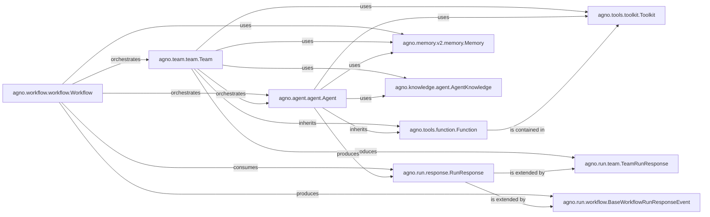

## Component Details

This subsystem forms the central execution engine of Agno, managing the lifecycle, execution flow, and collaborative interactions of AI agents and teams. It defines and executes multi-step, often asynchronous, workflows, ensuring the orderly progression of tasks and acting as the primary coordinator for AI behaviors within the system.

### agno.agent.agent.Agent
Represents an individual AI agent, serving as the fundamental unit of AI behavior within Agno. It encapsulates the agent's reasoning capabilities, tool utilization, and interactions with its memory and knowledge base. The `Agent` class itself can be treated as a callable function, allowing for flexible integration into larger orchestration patterns.

**Related Classes/Methods**:

- <a href="https://github.com/agno-agi/agno/blob/master/libs/agno/agno/agent/agent.py#L86-L7933" target="_blank" rel="noopener noreferrer">`agno.agent.agent.Agent` (86:7933)</a>

### agno.team.team.Team
Manages a group of AI agents, enabling collaborative task execution and complex interactions. It orchestrates the activities of its member agents, distributing tasks and coordinating their outputs to achieve a common goal. Similar to an `Agent`, a `Team` can also be treated as a callable function.

**Related Classes/Methods**:

- <a href="https://github.com/agno-agi/agno/blob/master/libs/agno/agno/team/team.py#L89-L7606" target="_blank" rel="noopener noreferrer">`agno.team.team.Team` (89:7606)</a>

### agno.workflow.workflow.Workflow
Defines and executes multi-step, often asynchronous, processes that coordinate the activities of individual agents and teams. It acts as the highest-level orchestrator, ensuring the orderly progression of tasks and managing the overall flow of AI behaviors within the system.

**Related Classes/Methods**:

- <a href="https://github.com/agno-agi/agno/blob/master/libs/agno/agno/workflow/workflow.py#L28-L908" target="_blank" rel="noopener noreferrer">`agno.workflow.workflow.Workflow` (28:908)</a>

### agno.tools.function.Function
The base class for individual functions or tools that can be executed by agents and teams. It defines the interface for tool calls and their expected inputs/outputs. Notably, `Agent` and `Team` themselves inherit from this, allowing them to be treated as callable units within the system.

**Related Classes/Methods**:

- <a href="https://github.com/agno-agi/agno/blob/master/libs/agno/agno/tools/function.py#L61-L402" target="_blank" rel="noopener noreferrer">`agno.tools.function.Function` (61:402)</a>

### agno.tools.toolkit.Toolkit
A collection of callable tools that agents and teams can discover and utilize to perform specific actions or interact with external systems. It acts as an interface to a wide range of functionalities.

**Related Classes/Methods**:

- <a href="https://github.com/agno-agi/agno/blob/master/libs/agno/agno/tools/toolkit.py#L7-L145" target="_blank" rel="noopener noreferrer">`agno.tools.toolkit.Toolkit` (7:145)</a>

### agno.run.response.RunResponse
A foundational component for handling and communicating the status, content, and events generated during the execution of agents and workflows. It provides a standardized structure for real-time feedback and post-execution analysis.

**Related Classes/Methods**:

- <a href="https://github.com/agno-agi/agno/blob/master/libs/agno/agno/run/response.py#L212-L404" target="_blank" rel="noopener noreferrer">`agno.run.response.RunResponse` (212:404)</a>

### agno.run.team.TeamRunResponse
Extends `RunResponse` to provide specific handling and data structures for events and responses generated during the execution of a team. It captures the nuances of collaborative agent interactions.

**Related Classes/Methods**:

- <a href="https://github.com/agno-agi/agno/blob/master/libs/agno/agno/run/team.py#L208-L416" target="_blank" rel="noopener noreferrer">`agno.run.team.TeamRunResponse` (208:416)</a>

### agno.run.workflow.BaseWorkflowRunResponseEvent
Defines the base structure for events specific to workflow execution, allowing for detailed tracking of workflow start, completion, and other significant milestones.

**Related Classes/Methods**:

- <a href="https://github.com/agno-agi/agno/blob/master/libs/agno/agno/run/workflow.py#L18-L43" target="_blank" rel="noopener noreferrer">`agno.run.workflow.BaseWorkflowRunResponseEvent` (18:43)</a>

### agno.memory.v2.memory.Memory
Manages the conversational and session memory for agents and teams, enabling them to maintain context, recall past interactions, and learn over time. It handles adding, replacing, deleting, and searching for memories.

**Related Classes/Methods**:

- <a href="https://github.com/agno-agi/agno/blob/master/libs/agno/agno/memory/v2/memory.py#L80-L1112" target="_blank" rel="noopener noreferrer">`agno.memory.v2.memory.Memory` (80:1112)</a>

### agno.knowledge.agent.AgentKnowledge
The central component for managing an agent's or team's knowledge base. It handles loading, filtering, searching, and adding documents, and tracks metadata structure, providing the necessary information for intelligent decision-making.

**Related Classes/Methods**:

- <a href="https://github.com/agno-agi/agno/blob/master/libs/agno/agno/knowledge/agent.py#L14-L665" target="_blank" rel="noopener noreferrer">`agno.knowledge.agent.AgentKnowledge` (14:665)</a>

### [FAQ](https://github.com/CodeBoarding/GeneratedOnBoardings/tree/main?tab=readme-ov-file#faq)